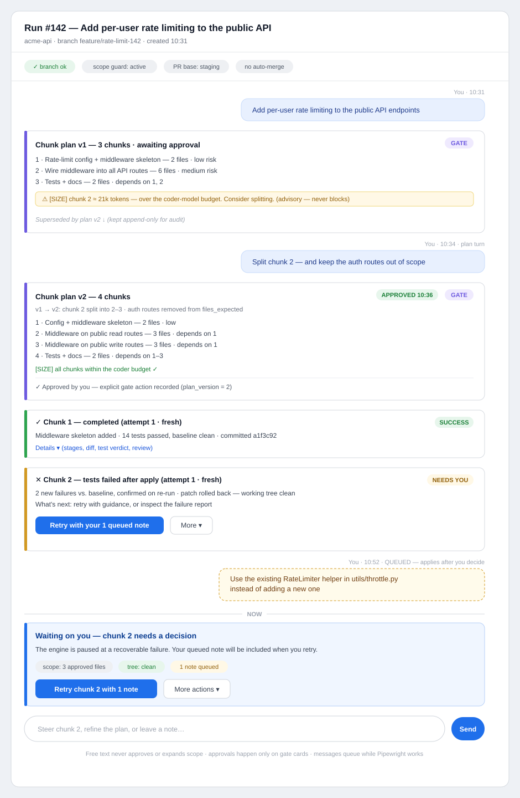

# Pipewright Redesign Proposal

**Date:** 2026-06-10
**Input:** `PIPEWRIGHT_REDESIGN_BRIEF.md` (supersedes the two earlier reviews)
**Mode:** Design only. No code in this document; no implementation implied until each PR is separately scoped and approved.
**Coverage:** This is **Pass 1 — Area A (pipeline execution engine)** per brief §10's two-pass option. Pass 2 (Area B, memory) and the cross-cutting reconciliation will be **appended to this same file**.

Everything below was verified against the code on 2026-06-10. Where the brief's framing needed correction, the correction is stated explicitly and cited.

---

# Pass 1 — Area A: Pipeline Execution Engine

## 1. Verified problem framing

### 1.1 Claims confirmed as stated

| Claim | Verified at | Notes |
|---|---|---|
| G1 — runs are single-message and immutable | `pipeline_runs.feature_description` is INSERT-only; no `SET feature_description` exists anywhere in `backend/`. The only follow-up channel is the signed clarification context for ambiguous-file selection (`routes/chunks.py:582-607`), which creates a *new* run. | Confirmed architectural, not a bug. |
| E1 — unscoped full-suite gate | `tester.py:141-164` runs the project's entire `test_command`; verdict is `passed = completed.returncode == 0`. No notion of changed-file scope, and no notion of a baseline: a pre-existing red test fails the chunk. | Confirmed. |
| E2 — crash ≡ failure | Same line (`tester.py:164`). The subprocess gets no `stdin` (`tester.py:150-157`), matching the observed Windows `init_sys_streams` crash. Timeout is also collapsed into "failed" with zeroed counts (`tester.py:218-240`). The #28B runtime classifier (`test_run_validation.py`) is deliberately display-only and classifies *command strength* (STRONG/WEAK/NONE/UNKNOWN), not *execution integrity* — it has no "harness crashed" category at all. | Confirmed, and slightly worse than stated: rollback is triggered *inside* `tester.py` (lines 201, 226, 247), so verification and remediation are welded together. |
| E3 — 4 LLM calls per trivial chunk | Triage (run-level) + planner + coder (`chunked_orchestrator.py:1396-1407`) + advisory reviewer on every success (`:1484-1486`). Intent classification is deterministic-first (`intent.py:591-599` never calls an LLM) with an LLM fallback — so worst case is 5. | Confirmed. |
| E4 — 60s lock-held sleeps | `planner.py:225`, `coder.py:486`: `asyncio.sleep(60)` + one retry on rate limit, no backoff/jitter/`Retry-After`. The whole chunk loop runs inside `project_repo_lock` (`chunked_orchestrator.py:1593`), so the sleep stalls every other run on the project. | Confirmed. |
| E5 — monolith + duplicated paths | `_execute_single_chunk` (`:1346-1492`) is one linear function. The human-retry path `_execute_retry_attempt` (`:2251-2391`) re-implements the same coder→scope→apply→test→review→pause sequence by hand. | Confirmed — see §1.2 for why this is worse than a style issue. |
| E6 — double-commit risk largely mitigated | Resume verifies the `test` checkpoint via `_verify_completed_checkpoint_safe` before skip-completing (`:1662-1696`). | Confirmed as defense-in-depth, not an active bug. |
| E9 — scope heuristics over-fire | Mechanically confirmed: `-` and `*` bullet markers are in neither `_CONNECTORS` nor `_FILLERS` (`file_scope_intent.py:73-80`), so `_collect_files` (`:187-206`) breaks with `started=False` on the first bullet. A bulleted "Only modify:" list collects **zero** allowlist files; the paths degrade to `uncertain_mentions` (`:232-234`), which reconciliation ignores. The plan-consistency check (`:414-426`) then fires per-chunk for any grounded prose path missing from *that chunk's* `files_expected` — even when the file is in scope elsewhere in the run — and `harden=True` forces `risk_level="high"` + `requires_human_review=True` (`:315-317`). | Confirmed exactly as the brief describes. |
| E10 — reviewer is advisory-only | `reviewer.py` docstring + `_run_advisory_review_safe` (`chunked_orchestrator.py:1311-1343`): never gates, all failures swallowed. Diff cap keeps the head (`reviewer.py:58, 108-114`). | Confirmed. Note there is an existing **soft-gate precedent**: the #28F test-validation acknowledgement (weak/none verdicts require an explicit human ack at final approval, `test_validation_ack_store.py`) — authority stays human, but the approval cannot proceed uninformed. The reviewer redesign should reuse this exact pattern. |
| E11 — large status surface | `core/statuses.py`: 21 run statuses + 6 chunk + 4 plan + 4 approval + 4 gate values. | Confirmed. |
| §8b — dead model constants | `TRIAGE_MODEL`/`PLANNER_MODEL`/`CODER_MODEL` are passed into `LLMRequest` but overwritten by `complete_for_role` (`backend/llm/__init__.py:76`: `request.model_copy(update={"model": model})`). Role config (`role_config.py`) is the real source of truth. | Confirmed: the constants lie. |
| §8 — no prompt caching | Zero matches for `cache`/`cache_control` under `backend/llm/`. | Confirmed. |

### 1.2 Where the brief needed refinement

These four findings change the design priorities; each was verified directly.

**(a) E7 is stale: triage paths *are* validated against the index.** `ground_triage_result_paths` (PR #9B, `plan_path_grounding.py`) runs at run creation — after triage, before persisting (`routes/chunks.py:1737-1743`) — and deterministically removes any `files_expected` path that isn't indexed or a plausible new file in an indexed directory. Hallucinated paths are *not* "only caught at scope_guard." What remains true and matters:
- Removal **hardens** the chunk (high risk + human review) and may leave `files_expected` empty, which `scope_guard` then blocks at *execution* time (`scope_guard.py:42-46`) — a late, dead-end failure for a problem known at plan time.
- There is no repair loop: grounding never re-asks triage or the user for better paths, even though a clarification mechanism already exists for ambiguous files.
- A *wrong but real* indexed path passes grounding untouched.

So E7's real shape is "grounding fails safe but dead-ends instead of repairing," not "no validation exists."

**(b) The G2/G3 dead-end has a precise, single cause.** `_HUMAN_RETRYABLE_FAILURE_TYPES` is a deliberate three-item allowlist — `PATCH_DOES_NOT_APPLY`, `TARGET_MISSING`, `PATCH_PARTIAL_APPLY_BLOCKED` (`patch_failures.py:208-214`). `TEST_FAILURE_AFTER_APPLY` is **explicitly excluded** from human retry. Combined with E1/E2 (any unrelated red test or interpreter crash → `TEST_FAILURE_AFTER_APPLY`), this is the exact mechanism behind run `c459bcde`'s "cannot retry / chunk is failed / nothing to approve": an infra accident is classified as a code failure, and a code failure is unretryable by policy.

**(c) `retry_with_instruction` is half-built.** The action identifier exists, is included in `_RETRY_WITH_INSTRUCTION_TYPES` (which *does* include `TEST_FAILURE_AFTER_APPLY` and `SCOPE_VIOLATION`, `patch_failures.py:171-179`), and is surfaced to the UI in failure reports (`:417`) — but **no endpoint or execution path exists anywhere** (grep: only `patch_failures.py` and its tests). The UI can suggest an action the backend cannot perform. G1's minimal primitive was already designed into the failure taxonomy and never wired.

**(d) The duplicated retry path has already diverged — in both directions.** The retry path has safety the main path lacks: `dry_run_changes` zero-mutation pre-flight (`chunked_orchestrator.py:2301-2319`) and `files_expected` surfaced into the plan (`_surface_files_expected_for_edit`, `:1945`). The main path has neither: the planner never sees `files_expected` (`_build_enriched_feature_description`, `:503-530` — previous-chunk context + chunk description + index-ranked files only), and a stale `old_string` is discovered only at apply. This is E8, but the sharper point is that it's *divergence between two copies of the same pipeline* — the strongest concrete evidence that the duplication is a defect factory, not a style complaint. Every future capability (continuation, scoped verify, soft gates) would have to be built twice and kept in sync by hand.

### 1.3 Synthesis — the three actual deficits

Re-reading the verified evidence, the eleven E-items reduce to three architectural deficits plus a policy hygiene problem:

1. **One execution path per entry point instead of one engine.** Fresh execution, resume, and human retry are three hand-maintained copies of the stage sequence (`_execute_single_chunk`, `_resume_chunked_pipeline_locked`'s skip logic, `_execute_retry_attempt`). They have already diverged (§1.2d). A fourth copy (continuation) would make it worse. E5, E6, E8, and half of G1 are this deficit.
2. **One bit of verdict where four classes of outcome exist.** `returncode == 0` conflates *the code is wrong* (assertion regression), *the harness broke* (crash/timeout/collection error/no tests), *the change was out of policy* (scope/forbidden), and *the environment was wrong* (dirty tree, missing branch). Recovery policy, retryability, narrative, and user expectations differ for each, but the system can only say "failed." E1, E2, G2, G3, and the retryability dead-end (§1.2b) are this deficit.
3. **No turn primitive.** A run cannot accept a second human message. The failure-report machinery already models attempts (`PatchFailureReport.attempts`, `record_retry_attempt`) and already names `retry_with_instruction`; what's missing is the durable turn → new attempt → carried-forward context loop, and a definition of how it composes with approval gates. G1 and the rest of G3 are this deficit.
4. **Policy as scattered constants** (§8b): dead model constants, fixed caps, magic sleeps, regex evidence parsing. Not architectural, but every candidate below must single-source these or it will regress quality silently.

What is **already good and must be kept** (per brief §0 "where the current design is already good, keep it and say why"):

- `scope_guard.py` — 58 lines, strict, exact-path, fails closed on empty scope. It is the safety contract's enforcement point; nothing below touches it.
- `patch_applier.py`'s guarded apply + backup-manifest rollback + post-apply re-validation, and `patch_dry_run.py`. Correct shape; the redesign only *moves call sites*, never semantics.
- Approval gates (`approval_gate.py`: `chunk_plan` / `chunk` / `final` / `memory_conflict`) and the #28F ack pattern. The continuation design plugs into these; it does not replace them.
- `plan_path_grounding` + `file_alias_grounding` + the clarification context — deterministic, zero-token, well-tested. The E9 fix builds on them.
- The checkpoint store and the resume verification discipline (`_verify_completed_checkpoint_safe`). The attempt ledger extends this; the durable-runtime doc (§8.7, append-only) already points the same direction.
- `test_run_validation.py`'s pure two-signal classifier — the infra-failure classifier below is Signal C added to this module's pattern, not a rival module.
- The deterministic-first intent classifier (`intent.py`) — already the right "boring beats clever" shape.

---

## 2. What the redesign must deliver

Constraints carried from brief §2 (all nine safety invariants) plus the quality-first principle (§0): no fixed budget, stage skip, or retry shortcut that degrades output quality; cost cuts only where quality loss is provably zero.

Targets, mapped to the felt problems:

| # | Target | Brief items |
|---|---|---|
| T1 | A user can steer a failed (or completed-but-wrong) chunk with a short message and the system re-attempts, carrying forward plan, prior diff, and classified failure evidence — without a new run and without bypassing any gate. | G1, E10↔G1 |
| T2 | An infra accident (crash, timeout, collection error, 0 tests, dirty env) is never reported as "your change failed tests," is auto-retryable within budget, and never dead-ends a chunk. | E2, G2 |
| T3 | A pre-existing red test never fails a chunk; verification is regression-aware against a baseline, with the full suite still gating final approval. | E1, G2 |
| T4 | Every failure produces a structured what-happened / why / what-you-can-do narrative; raw enums leave the UI. | G3, E11 |
| T5 | One execution path serves fresh / resume / retry / steered attempts; stage additions are made once. | E5, E6, E8 |
| T6 | Explicit user file constraints are recognized across formatting variants, and when uncertain are confirmed by the human at plan approval instead of silently hardening to high-risk. | E9 |
| T7 | High-severity reviewer findings (esp. `requirement_mismatch`) cannot be scrolled past: approval requires informed acknowledgement, and a finding can be turned into a steer (T1) in one click. AI authority is unchanged: it still cannot reject. | E10 |
| T8 | A trivial task costs ≤ 2–3 LLM calls with cached system prompts, with zero quality loss; retries are centralized with backoff + `Retry-After`, bounded, and never sleep 60s holding the repo lock. | E3, E4, G6 |
| T9 | Models, caps, timeouts, retry budgets, and verification mode are single-sourced policy with sane defaults — not constants in stage modules. | §8b |

---

## 3. Candidate architectures

### Candidate A — Targeted hardening of the existing linear chain

Keep the orchestrator's structure exactly as-is. Fix the verified defects in place:

- E2: `stdin=DEVNULL` + an execution-integrity classifier (Signal C in `test_run_validation.py`); split `TEST_FAILURE_AFTER_APPLY` into `TEST_REGRESSION` vs `HARNESS_ERROR`; make `HARNESS_ERROR` auto-retryable and add it to the human-retry allowlist.
- E1: baseline-aware verification (fail only on *newly failing* tests; see §4.4 — works inside the current tester).
- E9: line/bullet-aware tokenization in `file_scope_intent.py`; run-level awareness in the consistency check; stop hardening on note-only mismatches.
- E8: pass `files_expected` into the main-path planner prompt; call `dry_run_changes` in the main path (both already exist in the retry path).
- E4: a shared retry executor with backoff + jitter + `Retry-After`, bounded attempts.
- G1-minimal: implement the missing `retry_with_instruction` endpoint by extending `_retry_failed_chunk_locked` — widen eligibility to `_RETRY_WITH_INSTRUCTION_TYPES`, append the human steer to `_retry_plan_for_chunk`'s plan.

**Complexity:** low per item; each is an isolated, well-tested PR.
**Latency/cost:** fixes the 60s stalls; no structural call reduction (E3 unaddressed beyond caching).
**Migration risk:** minimal — no schema or status changes beyond one new failure type.
**Safety interaction:** none negative; every item tightens or preserves the contract.
**What it doesn't solve:** the steer becomes a *fourth* hand-synced copy of the stage sequence grafted onto `_execute_retry_attempt`; post-success refinement ("the sentence is wrong" — run `415a7669`) has no home because retry eligibility requires `chunk_status == "failed"` (`patch_failures.py:641`); narratives stay bolted onto enums; every future stage change still lands in 3–4 places. The asymmetries of §1.2d are *evidence this approach decays*: the current divergence was produced by exactly this style of targeted patching.

### Candidate B — Attempt-based stage engine ("one path, many entries") — **recommended**

Restructure the engine around three first-class concepts, keeping every safety module and gate exactly where it is:

1. **Stage list as data, one executor.** The chunk pipeline becomes an explicit ordered list of stages — `plan → code → preflight (scope + dry-run) → apply → verify → review → gate-or-commit` — executed by a single driver that handles checkpointing, outcome recording, and pause/fail/continue uniformly. Fresh execution, resume, human retry, and steered continuation are all *entry modes* of the same driver (differing only in which stages they skip because verified checkpoints/attempt context exist), eliminating the three current copies. This is the durable-runtime doc's §7 state machine made real at chunk level — and stays substrate-agnostic: it runs in-process today and ports unchanged onto the Agent-R2 worker later.
2. **Attempts as first-class records.** Every pass of the driver over a chunk writes an attempt row: entry mode (`fresh / resume / auto_retry / human_retry / steered`), the steer text if any, per-stage outcomes, evidence references, and final classified outcome. This *extends* what exists — `PatchFailureReport.attempts` already models recovery attempts and the checkpoint store is already per-chunk-per-step; the ledger unifies them and makes them append-only (durable doc §8.7).
3. **A structured outcome taxonomy instead of pass/fail.** Every stage returns an outcome in one of five classes: `SUCCESS`, `CODE_REJECTED` (regression, requirement mismatch — the change is wrong), `INFRA_ERROR` (harness crash, timeout-ambiguous, collection error, rate-limit exhaustion — the world broke), `POLICY_BLOCKED` (scope violation, forbidden path, dirty tree — the rules said no), `NEEDS_HUMAN` (gates, acks, clarifications). Retryability, auto-retry budgets, narrative templates, and UI phase all derive from the class — replacing both `returncode == 0` and the hand-curated retryability frozensets with policy over a taxonomy.

On top of those three, the engine-level features: continuation turns (§4.3), baseline/scoped verification (§4.4), reviewer ack soft gate (§4.5), the policy object (§4.7), and the narrative state model (§4.8).

**Complexity:** the highest of the three — but it is a *strangler* refactor, not a rewrite: stages are extracted as pure modules first (most already are: planner, coder, scope_guard, patch_applier, tester), the driver replaces `_execute_single_chunk` second, the retry/resume paths collapse into entry modes third. Behavior-preserving at each step, testable per stage.
**Latency/cost:** enables E3 properly (a stage list per task profile — trivial tasks get a merged plan+code stage; see §4.7), plus caching and the centralized retry executor.
**Migration risk:** medium. Mitigations: DB statuses keep their current string values (the new phase/narrative is a derived read-model, no migration of historical rows); the attempt ledger is additive tables/columns; the driver lands behind the existing public functions (`execute_approved_chunks`, `resume_chunked_pipeline`, `retry_failed_chunk` keep their signatures).
**Safety interaction:** four explicit tensions, all resolvable — §5.
**What it doesn't solve:** process-level durability (locks die with the process, event bus in-memory) — deliberately out of scope here; that is the durable-runtime roadmap (R1–R7), and this design composes with it rather than competing.

### Candidate C — Conversational agent-loop engine (run = thread, coder = tool-using agent)

Rebuild execution the way Claude Code/Cursor work: the run is a conversation; a single agentic coder session holds the task, reads files via tools, proposes edits, runs tests as a tool, and iterates within the session. Triage/planner collapse into the loop; chunking becomes the agent's internal task list.

**Complexity:** a rewrite of the engine and most of the UI contract.
**Latency/cost:** best-in-class for small tasks (one session, native multi-turn); high variance for large ones.
**Migration risk:** highest — replaces, rather than extends, the chunked orchestrator, directly against the durable-runtime doc's "extend, don't rewrite" finding and CLAUDE.md's smallest-correct-change principle.
**Safety interaction — the disqualifier:** the agent-loop model wants to *discover* scope as it explores, but contract §2.1–2.2 requires scope to be *approved before* implementation. Reconciling them forces one of: (a) constant scope-expansion interrupts (terrible UX — worse than today's dead-ends), (b) pre-approving broad scope (weakens the moat in spirit while technically inside it), or (c) a sandboxed exploration phase whose product is still a chunk plan — which is just Candidate B's triage with extra steps. The approval artifact also degrades: "I'll fix the helper and its test" is a vaguer thing to approve than a file-listed chunk plan. Auditability (which model did what, which human approved what) is structurally harder in a free-running loop. The durable-runtime doc reached the same conclusion from the infrastructure side ("the autonomous-loop pattern is the opposite of what Pipewright wants").

**Verdict:** rejected for this product *now* — but three pieces are harvested into B: the turn-as-message vocabulary for continuation, steers as plain conversational text, and the single-call profile for trivial chunks.

### Trade-off summary

| | A: Targeted hardening | B: Attempt-based stage engine | C: Agent loop |
|---|---|---|---|
| Solves G2/G3 (robust small tasks, no dead-ends) | Yes | Yes | Yes |
| Solves G1 (continuation incl. post-success refinement) | Partially (failure-only steer, 4th code copy) | **Yes, first-class** | Yes, natively |
| Solves E5/§1.2d (divergent duplicate paths) | No — worsens | **Yes — the point** | Moot (rewrite) |
| E3 cost structure for trivial tasks | Caching only | Stage profiles + caching | Best |
| Migration risk | Minimal | Medium (strangler) | High (rewrite) |
| §2 safety contract | Neutral-positive | 4 named tensions, all resolvable (§5) | Structural tension with §2.1/2.2 |
| Fits durable-runtime roadmap | Neutral | **Designed for it** | Conflicts |
| Time-to-first-relief | Weeks | Same weeks (Phase 0/1 of B *is* A — §6) | Months |

---

## 4. Recommended architecture (Candidate B, with A's items sequenced first)

The decisive argument: **every item in Candidate A is a pure module that Candidate B needs anyway.** The infra classifier, baseline verification, parser fix, pre-flight symmetry, and retry executor are stage internals under B. Building them first (as A-shaped PRs) delivers user-felt relief in weeks and de-risks the structural swap — if the driver refactor stalled, the A-items would already have shipped standalone value. There is no fork in the road until Phase 2 (§6).

### 4.1 Stage driver and entry modes

One driver executes an ordered stage list per chunk. Each stage is a callable with a uniform contract: inputs (chunk, attempt context, policy), output (a typed `StageOutcome`: class from §3.B-3, evidence refs, checkpoint payload). The driver owns: dependency/dirty-tree preconditions, checkpoint write-and-verify, outcome persistence to the attempt ledger, pause (gate) returns, and the auto-retry loop for `INFRA_ERROR` outcomes within policy budget.

Entry modes replace today's three paths:

| Mode | Replaces | Behavior |
|---|---|---|
| `fresh` | `_execute_single_chunk` | All stages. |
| `resume` | resume skip-logic | Skip stages with verified checkpoints (existing `_verify_completed_checkpoint_safe` discipline, kept). |
| `auto_retry` | (new; today's terminal infra failures) | Re-run from the failed stage; bounded by policy; only for `INFRA_ERROR`. |
| `human_retry` | `_retry_failed_chunk_locked` | Re-run from `code` with the same plan; existing eligibility evaluation kept, re-expressed over outcome classes. |
| `steered` | (the missing `retry_with_instruction`) | Re-run from `code` (or `plan` if the steer contradicts the plan) with the continuation context block (§4.3). |

Invariants the driver enforces *identically in every mode* (this is what kills the §1.2d divergence class): scope pre-check before any write, dry-run before apply, no commit without effective change, rollback to clean tree on any failed attempt, verdict persistence for both pass and fail.

`tester.py` loses its rollback side-effect (T2): stages produce verdicts; the *driver* decides remediation from the outcome class. Rollback behavior itself is unchanged — it just moves to the one place that already makes that decision in two other paths today.

### 4.2 Outcome taxonomy and the infra/test split (E2, T2)

Extend `test_run_validation.py` with execution-integrity detection (Signal C), keeping it pure: interpreter-crash markers (`Fatal Python error`, bootstrap tracebacks), command-not-found exit codes (127, Windows 9009), signal kills, collection errors, positive zero-test markers (already present), and timeout. Joined with the existing Signals A/B:

- exit ≠ 0 + crash/collection/not-found evidence → `INFRA_ERROR` (auto-retry, then `NEEDS_HUMAN` with narrative; never "tests failed")
- exit ≠ 0 + parsed failure counts → `CODE_REJECTED` (rollback; steerable, T1)
- timeout → its own outcome `TIMEOUT_AMBIGUOUS` under `CODE_REJECTED`-with-caveat: a coder-introduced infinite loop and a slow suite are indistinguishable, so it is **not** auto-retried (re-running an infinite loop helps nobody); narrative explains both possibilities and offers steer + a policy knob for the timeout.
- exit = 0 + STRONG/WEAK/UNKNOWN verdict → unchanged (#28D/#28F flow kept).

Root-cause fixes ride along: `stdin=DEVNULL` on the test subprocess; counts parsing stays best-effort but is demoted from "fact" to "evidence" feeding the classifier (§8b).

The retryability frozensets in `patch_failures.py` are re-derived from outcome classes — preserving today's deliberate exclusions (`SCOPE_VIOLATION` is `POLICY_BLOCKED`: never auto-retried, steerable only; deterministic failures stay non-retryable) while un-dead-ending `TEST_REGRESSION` (steerable) and `HARNESS_ERROR` (auto-retryable). The closed `PatchFailureType` taxonomy and report format are kept for audit continuity; each type maps onto one class.

### 4.3 Continuation: turns over a durable run (G1, T1)

**Primitive decision:** *turns appended to a durable run, executed as new attempts on existing chunks* — not cheap re-runs that inherit context. Reasons: re-runs discard the approved plan (forcing re-approval of an unchanged plan — gate fatigue with no safety gain); attempts keep the audit trail in one place; and the failure-report machinery already models attempt history.

Mechanics:

- A run gains an append-only turn log: user message → targeted chunk → attempt → outcome → narrative. The original `feature_description` stays immutable (the audit anchor); turns are additive context, displayed as a conversation.
- A steer on a **failed** chunk starts a `steered` attempt: same approved plan, same `files_expected`, continuation context = approved plan + prior coder handoff + prior applied-diff *as text* + classified failure evidence + the steer.
- A steer on a **completed** chunk (run `415a7669`'s "wrong sentence" case, and the E10 one-click path) starts a `steered` attempt whose product is a **new commit** on the run branch within the same `files_expected`; the final-approval gate shows the cumulative diff. The no-effective-change commit guard (`_commit_and_complete_chunk:712-726`) already protects contract §2.3.
- **The tree is always rolled back clean between attempts.** The prior diff travels as *context*, never as standing working-tree state. This deliberately costs regeneration fidelity but preserves the clean-tree precondition, rollback semantics, and the repo lock's meaning. (Rejected alternative recorded in §5.)
- Bounds (policy, §4.7): per-chunk attempt budget across `human_retry`+`steered` (the existing `max_human_retries` generalized), a per-run token ceiling, and turn length limits. At budget exhaustion: terminal with narrative — fail safe, clearly.
- Out-of-scope steers ("also fix utils.py") are **not** silently honored: the steer is advisory text (contract §2.7 analog); touching a new file routes through the existing scope-expansion approval flow (#27), which is exactly the human re-grant the contract requires. The narrative says so.
- Gates are unchanged: a steered attempt on a `requires_human_review` chunk pauses at the same chunk gate; final approval is always re-required after any post-success refinement (the #281 final-approval-after-chunk-approval behavior generalizes).

Relation to existing machinery: `human_retry` becomes the steer-less special case; `_persist_retry_patch_failure`'s report-rotation logic becomes the ledger's failure-evidence writer; the #26D3a branch precheck and #26D1 eligibility evaluation carry over verbatim as driver preconditions.

### 4.4 Verification policy: baseline-aware, two-tier (E1, T3)

**The primary fix is baseline-awareness, not scoping.** Run `a584f251` failed on infra, but `c459bcde`-class failures come from pre-existing/flaky reds. Deterministic design:

- **Baseline:** at execution start (post-approval, on the run branch, before chunk 1), run the test command once and record failing test IDs. After each committed chunk, that chunk's green-or-disclosed result becomes the next chunk's baseline — zero extra runs after the first.
- **Chunk gate:** *newly failing* tests (vs. baseline) → `CODE_REJECTED`. Pre-existing failures → disclosed in the narrative and the approval summaries, never charged to the chunk. A baseline that is itself `INFRA_ERROR`-classified pauses the run with a "your test environment is broken" narrative *before* any LLM spend — turning today's most expensive failure mode into the cheapest.
- **Run gate:** the full suite still runs before final approval (it's the last chunk's verification), with the baseline delta in the final summary. The #28F weak/none ack gate is unchanged.
- **Scoped verification** (run only impacted tests per chunk) becomes a *latency option inside the same policy*, default **off** (quality-first: full signal per chunk while suite duration is tolerable). When enabled (policy threshold on measured suite duration), the chunk gate runs a deterministic impacted subset (test files in `files_expected` + naming-convention matches; an import graph is a later refinement), and the full suite runs at minimum before final approval. The honest cost is stated in §5 (tension 1).

Honesty about the trade: "tests passed" becomes "no new failures; N pre-existing failures disclosed." That is *more* truthful than today's behavior, where a red baseline silently makes the product unusable for that repo — but it is a redefinition of the strong-validation promise and is flagged as decision point §5.1.

### 4.5 Reviewer: informed-approval soft gate (E10, T7)

The reviewer keeps zero authority — it still cannot reject, block, or merge (its own prompt says so, `reviewer.py:77-79`). What changes is the *human's* gate, reusing the #28F acknowledgement pattern exactly:

- A `high`-severity finding (always for `requirement_mismatch` and `security`; policy for others) creates an acknowledgement requirement on the chunk's gate — or, for non-review chunks, on final approval. Approve stays disabled until the findings panel has been explicitly acknowledged, with an optional audited reason.
- Each finding offers **"steer this"**: one click converts the finding into a §4.3 turn ("the README sentence doesn't match the request — fix to the exact requested sentence"), making review findings *actionable* instead of decorative. This closes the `415a7669` gap without giving the AI any authority: the human chooses.
- Review runs on a small policy stage-set even when advisory analysis fails (unchanged best-effort), and the diff cap moves into policy (§4.7) with a smarter default (head + tail rather than head-only) — low impact, as the brief notes, but free once the cap is policy.

Failure-mode guard: an `unavailable` review (LLM down) must not block approval — the ack requirement attaches only to *delivered* high-severity findings, mirroring how #28F treats a NULL verdict today (no ack required), so the reviewer can never become a denial-of-approval vector.

### 4.6 Scope intent without false positives (E9, T6)

Three layers, in order of authority:

1. **Fix the deterministic parser** (it stays, per "boring and testable"): line-aware tokenization so newlines/bullets (`-`, `*`, `1.`) act as connectors after a colon-terminated cue ("Only modify:"), plus tests over the observed formats (comma list, bulleted list, one-per-line). The `a584f251` request parses correctly with ~20 lines of tokenizer change.
2. **Make detected constraints visible and editable at plan approval.** The chunk-plan gate already exists; detected allowlist/forbidden/reference sets are displayed as structured, human-editable fields on that screen. A missed parse becomes a 5-second human correction instead of a silent high-risk hardening. The human-confirmed result is recorded with the approval (it's part of what was approved — strengthening contract §2.1's artifact, not adding a new gate).
3. **Stop punitive hardening on note-only mismatches.** The plan-consistency check becomes run-aware: a prose-mentioned file that lives in *another chunk's* `files_expected` produces no note at all; a genuinely unscoped mention keeps the `[SCOPE]` note but only escalates `requires_human_review` — never `risk_level="high"` — when the chunk would otherwise auto-commit. Forbidden-file removals (a real safety event) keep full hardening.

LLM-assisted constraint extraction is deliberately **not** proposed: the failure mode was formatting, which is a tokenizer problem; an LLM here adds nondeterminism to a safety-adjacent input (it would *request* scope, which is fine, but the deterministic+human-confirm path achieves the same with less machinery).

Grounding repair (E7-refined): when grounding/constraint reconciliation leaves a chunk's `files_expected` empty, surface the existing ambiguous-file clarification flow *at plan time* ("I couldn't ground these paths — pick or correct") instead of persisting a chunk that `scope_guard` will inevitably kill at execution. Fail fast where the knowledge exists.

### 4.7 Policy object, retry executor, call structure, caching (E3, E4, G6, T8, T9)

**Policy.** One module owns execution policy, layered defaults → per-project overrides: role model selection (already `role_config` — the dead per-stage constants are deleted), per-stage temperature/max-tokens, tester timeout, output caps, reviewer caps, retry budgets (parse-retry, rate-limit, auto-infra-retry, human/steered attempts), verification mode + suite-duration threshold, and stage profiles. Every consumer reads policy; no stage-local constants with behavioral effect. This is §8b's "policy, not constants," and the durable-runtime doc's snapshot discipline applies: the policy in force is snapshotted per run.

**Retry executor.** One async helper wraps all provider calls: exponential backoff + jitter, `Retry-After` honored, bounded total attempts, typed outcome on exhaustion (`INFRA_ERROR`, surfaced as a pause-with-narrative rather than a stack trace). The 60-second lock-held sleeps in `planner.py:225`/`coder.py:486` are deleted. Long waits beyond policy bound → pause the run (`paused_provider_quota` semantics from the durable doc §7.1, implementable in-process now as a paused status + narrative; automatic re-wake arrives with Agent-R7).

**Call structure (E3) — quality-first justification per call:**
- *Triage:* kept always. It produces the approval artifact (`files_expected`, risk, chunking) — the contract depends on it.
- *Planner:* merged into the coder for the trivial profile — single chunk, `complexity=easy`, fully grounded non-empty `files_expected`, low risk, no security/db flags. For those tasks the planner demonstrably re-derives what triage already decided (§1.1-E3); the merged stage receives the triage chunk + `files_expected` + file contents and produces plan-summary + handoff in one call. Quality loss is zero *by construction of the profile*; anything outside it keeps the separate planner. The plan-summary remains in the output for the audit trail.
- *Coder:* kept always, now seeing `files_expected` in every mode (closing §1.2d).
- *Reviewer:* **kept always, including for trivial tasks** — E10's evidence is that review matters *most* exactly when everything else says green. Cutting the quality stage to save a call is the trade the brief forbids.

Net for a trivial task: 2 calls + (LLM intent fallback when deterministic intent misses) vs. today's 4–5 — with *more* safety (preflight, baseline, ack gate), not less.

**Prompt caching.** Provider-level caching (Anthropic `cache_control`, Gemini context caching) on the static system prompts and the per-run-stable blocks (memory block, repo file lists). Zero quality impact by definition (identical bytes), pure cost/latency win, orthogonal to everything else. Sized as one provider-layer PR + per-provider flags in policy. (Per-stage memory recompute, M9, is Area B; the engine just exposes "per-run stable context" hooks for Pass 2 to fill.)

### 4.8 State and narrative model (E11, G3, T4)

Two layers, cleanly split:

- **Machine states (internal, DB):** keep the current strings — they are written by many modules and read by the UI/tests; renaming them buys nothing. The driver tightens *transitions* (single writer per chunk), and the durable-runtime doc §7.1 remains the long-term superset.
- **User-facing phase + narrative (derived read-model, no migration):** every run/chunk projects to one of six phases — `Planning / Waiting for you / Working / Needs attention / Done / Stopped` — plus a structured narrative generated **from templates over the outcome taxonomy** (deterministic; an LLM may later *polish phrasing* as display-only text, never as the source of state): *what happened* (outcome class + evidence summary, e.g. "2 new test failures in test_app.py; 3 pre-existing failures not caused by this change"), *why* (classifier reason), *what's next* (the legal actions for that outcome class — retry budget remaining, steer, approve scope expansion, fix env). This extends the existing read-model direction (`operator_state.py`, `docs/design/run-detail-guided-ux.md`, `failure-state-ux-cleanup.md`) rather than inventing a parallel one. Raw enums remain in the API for compatibility; the UI consumes phases + narratives.

This is what turns `TEST_FAILURE_AFTER_APPLY` + disabled buttons into "The change applied cleanly, but the test process crashed before any test ran (a Windows stdin issue, not your change). I retried once; it crashed again. You can retry, or steer me." — with the buttons live (T2 + T4 together).

---

## 5. Safety-contract tensions (explicit decision points)

Per brief §0: none of these is assumed; each is a named decision the maintainer must approve or reject.

1. **Baseline-aware / scoped verification redefines "tests passed" (contracts §2.3-spirit, §2.9).** Today a chunk commit requires the whole suite green; under §4.4 it requires *no new failures*, with pre-existing failures disclosed (and, if scoped mode is ever enabled, "scoped subset green" with full suite deferred to the run gate). This is strictly more honest and unblocks red-baseline repos — but a committed chunk may now sit on a branch whose suite is red for pre-existing reasons. Mitigations: disclosure in every approval summary and the final gate; the #28F-style ack extended to "approve with N pre-existing failures"; scoped mode default-off. **Decision: accept the regression-vs-baseline gate? Accept scoped mode as a policy option?**
2. **Auto-retry of `INFRA_ERROR` performs implementation work without a fresh human trigger (contract §2.1-adjacent).** Bounded auto-retry re-runs coder/apply/test on an *already-approved* chunk plan — within the approval's meaning, and precedented by the existing parse-retry (the coder already silently retries once today). But it spends tokens and time autonomously. Mitigations: small bounded budget in policy (default 1–2), ledger-visible attempts, only for `INFRA_ERROR` class (never scope/code failures). **Decision: confirm auto-retry scope and default budget.**
3. **Steered attempts generate new code from human free-text without re-approving the plan (contracts §2.1, §2.2).** Position: the steer is advisory context *within* the approved chunk plan and approved `files_expected`; scope_guard still enforces; out-of-scope intent routes to the existing scope-expansion approval; chunk/final gates still fire. The plan-approval artifact's meaning shifts from "this exact wording" to "this chunk's goal + these files," which is arguably what humans believe they approve today. A conservative variant — any steer mentioning a file *not* in `files_expected` requires explicit re-confirmation even when the model wasn't going to touch it — is available. **Decision: confirm steers-without-replan inside unchanged scope; choose the conservative variant or not.**
4. **Reviewer ack gate gives AI findings procedural (not decisional) weight (contract §2-spirit: AI never gates).** The AI still cannot reject; but a delivered high-severity finding makes approval require an explicit ack, and an unavailable reviewer must never block (designed in §4.5). Residual risk: finding-spam fatigue → mitigate with severity threshold in policy and per-category ack granularity. **Decision: approve ack-required severity set (proposal: `high` × {requirement_mismatch, security}).**
5. **Rejected alternative, recorded:** keeping a failed diff *applied* between attempts (faster iteration, like a human would) was rejected — it would break the clean-tree precondition, blur rollback guarantees, and hold the repo hostage between turns (contracts §2.3, §2.9). Continuation carries the diff as text only (§4.3).
6. **Non-tension, stated for completeness:** narratives are display-only derivations; like memory, they are never an authority channel for scope/approval/Git decisions (contract §2.7 analog). Nothing in this design lets a narrative or steer touch forbidden paths (§2.5) or alter PR-base/auto-merge rules (§2.4) — those modules are untouched.

---

## 6. Sequencing for Area A (small, separately-tested PRs)

Ordering principle: deterministic quick wins first (each independently shippable, all reused by the engine later), then the structural swap, then the features that need the swap. No PR mixes phases. (Cross-area sequencing — including memory — is reconciled after Pass 2.)

**Phase 0 — independent deterministic fixes (each one PR):**
1. Test-command auto-detection (§7 of the brief): recommend **ship first, standalone** — zero tokens, removes the G4 onboarding wall, and §4.4's baseline gives detected commands a runtime verification path. Detect-and-prefill only; never detect-and-execute.
2. E2 root cause: `stdin=DEVNULL` (+ regression test with a stdin-reading fake command).
3. E9 parser: line/bullet-aware tokenization + run-aware consistency check + hardening downgrade (`file_scope_intent.py` only).
4. E8 symmetry: `files_expected` into the main-path planner prompt; `dry_run_changes` into the main path before apply.
5. E4: shared retry executor; delete the 60s sleeps.
6. §8b hygiene: delete dead model constants; introduce the policy module and move existing constants into it (pure relocation, no behavior change).

**Phase 1 — outcome classification (sequenced PRs):**
7. Signal C in `test_run_validation.py` (pure classifier + tests over the observed crash outputs).
8. Split `TEST_FAILURE_AFTER_APPLY` → `TEST_REGRESSION` / `HARNESS_ERROR` in `patch_failures.py`; bounded auto-retry for `HARNESS_ERROR` (decision §5.2 needed first); narrative templates for both (first slice of T4).
9. Baseline-aware verification in `tester.py` + run-start baseline (decision §5.1 needed first).

**Phase 2 — the structural swap (strangler, behavior-preserving):**
10. Extract stages behind the uniform stage contract (no caller change).
11. The driver replaces `_execute_single_chunk` internals; `fresh` + `resume` modes; golden-path tests proving identical behavior.
12. `human_retry` collapses into the driver; `_execute_retry_attempt` deleted; attempt ledger lands (additive schema).

**Phase 3 — continuation (needs Phase 2):**
13. Turn log + `steered` mode for failed chunks (the real `retry_with_instruction`); budgets in policy (decision §5.3 needed first).
14. Post-success refinement attempts + cumulative final diff.

**Phase 4 — review + narrative + cost:**
15. Reviewer ack soft gate (decision §5.4) + "steer this" hook into Phase 3.
16. Phase/narrative read-model for the UI (extends operator_state).
17. Trivial-task stage profile (merged plan+code) behind policy; provider prompt caching.

Alignment with the durable-runtime roadmap: Phases 0–4 are all pre-R1-compatible (in-process, SQLite). Phase 2's driver is the natural unit that Agent-R2 later moves onto a worker; the attempt ledger anticipates R5's append-only checkpoints; pause-on-quota anticipates R7. Nothing here blocks or duplicates that roadmap.

---

## 7. Open questions for the maintainer

1. The four decision points in §5 (verification semantics, auto-retry budget, steer-without-replan, ack severity set).
2. Attempt budget defaults: proposal is 5 combined human/steered attempts per chunk and a per-run token ceiling in policy — sane?
3. Should post-success refinement (§4.3) be in the first continuation slice, or deferred until failure-steering has soaked? (Proposal: defer one release; it adds the most UX value but touches the final-approval invariants.)
4. Phase 0 item 1 (test-command detection) tolerates shipping before *any* decision in §5 — confirm it can proceed immediately as a standalone PR.

---

## Appendix A — Verification ledger (Pass 1)

| Brief claim | Status after code read | Key evidence |
|---|---|---|
| G1 single-message runs | Confirmed | No `feature_description` UPDATE path; clarification flow creates new runs (`chunks.py:582-607`) |
| E1 unscoped gate | Confirmed | `tester.py:141,164`; no baseline concept |
| E2 crash ≡ fail | Confirmed + sharpened | `tester.py:150-157` (no stdin), `:164`; rollback inside tester `:201,226,247`; #28B has no integrity signal |
| E3 four calls | Confirmed (5 worst-case w/ LLM intent fallback) | `chunked_orchestrator.py:1396-1486`; `intent.py:591-599,722` |
| E4 60s lock-held sleep | Confirmed | `planner.py:225`, `coder.py:486`, lock at `chunked_orchestrator.py:1593` |
| E5 monolith + duplicate retry path | Confirmed + sharpened (paths already diverged both directions) | `:1346-1492` vs `:2251-2391`; dry-run only in retry (`:2301`); `files_expected` surfaced only in retry (`:1945`) |
| E6 double-commit | Confirmed mitigated | `:1662-1696` |
| E7 triage paths unvalidated | **Stale — refined** | `ground_triage_result_paths` wired at `chunks.py:1737`; residual gaps: no repair loop, empty-scope dead-end at execution, wrong-but-real paths pass |
| E8 planner blind to scope; late `old_string` check | Confirmed (main path only) | `_build_enriched_feature_description:503-530`; retry path has both mitigations |
| E9 bullet bug + punitive harden | Confirmed mechanically | `file_scope_intent.py:73-80,187-206,232-234,315-317,414-426` |
| E10 advisory-only reviewer | Confirmed; #28F ack is the reusable soft-gate pattern | `reviewer.py:77-79`; `_run_advisory_review_safe:1311` |
| E11 ~20 statuses | Confirmed (21+6+4+4+4) | `core/statuses.py` |
| §8b dead model constants | Confirmed | `backend/llm/__init__.py:76` overrides `LLMRequest.model` |
| §8 no prompt caching | Confirmed | zero `cache` matches under `backend/llm/` |
| G2/G3 dead-end cause | **Sharpened**: `TEST_FAILURE_AFTER_APPLY` deliberately excluded from human retry; `retry_with_instruction` surfaced to UI but has no execution path | `patch_failures.py:159-214,417,641-654`; grep: no endpoint |

# Pass 2 — Area B: Memory System

Verified against the code and the four memory docs (`memory-architecture.md`, `memory-injection-discipline.md`, `memory-m3-trust-lifecycle.md`, `sqlite-vector-memory-readiness.md` / #32G) on 2026-06-10. Section numbering continues from Pass 1.

## 8. Verified problem framing

### 8.1 Claims confirmed as stated

| Claim | Verified at | Notes |
|---|---|---|
| M1 — retrieval has no relevance to the request | `prompt_builder.py:353-358`: sort key is `(category_rank, scope_rank, priority, created_at)`. Stronger than the brief states: the builder **never receives the feature description or chunk task at all** — there is no input it could match against. Additionally, the `scopes` boost parameter exists (`:326-329`) but no runtime caller passes it, so scope ranking degenerates to "global first, everything else last" for every role. | Confirmed + sharpened. |
| M4 — greedy packing is mild | `:364-377` uses `continue`, tracks `budget_excluded_entries`; safety categories sort first so they drop last. | Confirmed as the brief corrected it. |
| M5 — no quality gate on LLM-suggested facts | `run_outcome_suggestions.py:217-244` (`_handoff_candidates`): any non-empty string ≤ 280 chars from `suggested_memory_entries` becomes a pending suggestion with `category="other"`, no scoring. Upstream, the planner/coder prompts solicit bare strings — `"suggested_memory_entries": ["fact worth storing in project memory"]` (`planner.py:59`) — with zero quality criteria, despite `memory-architecture.md` §2.12 having designed a structured schema. | Confirmed; see §8.2c for the refinement. |
| M6 — no staleness lifecycle in practice | `flag_stale_memories` (`memory_store.py:774-802`) has **only test callers** and ages by `created_at` — which `memory-architecture.md` Finding #3 itself calls wrong. `last_verified_at` exists and nothing updates it at runtime. (M3A audit G5.) | Confirmed. |
| M7 — detection is an if/elif substring chain | `bootstrap.py:191-492`. | Confirmed. |
| M8 — reviewer/summary budgets defined but unwired | `prompt_builder.py:6-11` docstring states it; **and the non-wiring is deliberate** — `memory-injection-discipline.md` §8 defers reviewer injection as a sycophancy/poisoning amplifier requiring its own adversarial design. | Confirmed, reframed as a decision already made, not an oversight. |
| M9 — per-stage recompute | Triage, planner, coder each call `build_project_memory_block_detailed` + `capture_memory_injection` (`triage.py:240-254`, `planner.py:164-178`, `coder.py:339-350`): 3 reads + 3 provenance writes per chunk. | Confirmed; see §11.5 — under request-aware selection the recompute becomes *correct*, and only the row-read is waste. |
| M10 — fixed budgets + crude estimator | `ROLE_TOKEN_BUDGETS` hardcoded (`prompt_builder.py:42-49`); estimator is `(len+3)//4` (`:133-134`); hard ceiling drops facts. Safety facts sort first but **can** still drop on a tight budget (triage=400). | Confirmed mechanically; see §8.2b. |
| M3 — provenance capture synchronous, not fire-and-forget | `capture_memory_injection` called directly at all three sites; best-effort, never raises (`injection_store.py:263-307`). | Confirmed; low priority, folded into §11.5. |

### 8.2 Where the brief needed refinement

**(a) The trust lifecycle is far more built than the M-items imply — the redesign must extend it, not reinvent it.** Implemented and verified as-built: append-only per-run/role/attempt injection provenance (M3C1, `memory_injection_events`); compute-on-read advisory analysis for near-duplicates and contradictions (M3C2, over the pure M3B helpers in `memory_trust.py`, with `recency_implies_truth=False` baked in); a human mark-stale route (M3D1); **supersession lineage** with a `historical` producer and an atomic approve-and-supersede route (M3D2, `superseded_by_fact_id`); lifecycle UI with confirmation modals (M3E1–E3); structured exclusion reasons (`budget_dropped`, `category_not_allowed_for_role`) surfaced in provenance, preview, and frontend (M3F2a); and read-only repo-reality warnings for the `db_engine` dimension (M3F3). Beyond the audit: the DB memory-conflict **run gate is now wired into execution** (`chunked_orchestrator.py:44-46, 212-264` — `is_db_sensitive_run` + `evaluate_db_memory_conflicts`; the M3A audit's G7 "unwired" is stale). Memory already has one execution-coupled lifecycle integration: deterministic conflict detection → run blocked → human decides. That is the template to widen, and the action vocabulary (stale / archive / supersede / verify / conflict-gate) is **complete**. What's missing is *when detection runs* (only when a human clicks the analysis endpoint) and *how much it can see* (one dimension, `db_engine`) — not the actions.

**(b) M10 is no longer a *silent* drop — the residual defect is that drops can happen at all.** Since M3F2a, budget-dropped facts are persisted with reasons and the frontend explicitly highlights "Safety memory was budget-dropped." The injection-discipline doc's §3 worst case ("a dropped guardrail must be loud, not silent") is shipped. What remains wrong, per the quality-first principle: (1) a safety fact can still be *dropped* — surfacing a dropped guardrail is better than silence but worse than never dropping it; (2) the cap is a fixed per-role constant unrelated to the actual model's context window; (3) the "tokens" being budgeted are a char/4 guess. The fix is selection semantics (§11.1), not more surfacing.

**(c) M5's noise has one precise channel, and generation is less dangerous than the brief implies.** Suggestion generation is **API/human-triggered only** (`routes/memory.py:510-530`; the M3A audit's "critical finding" — no orchestrator hook exists). Of its four channels, three are deterministic templates (test command on completed runs, patch-failure notes from a fixed enum table, sanitized rejection reasons — `run_outcome_suggestions.py:59-102, 200-291`) and are quality-bounded by construction. The unbounded channel is exactly one: the **unstructured handoff passthrough** (§8.1-M5). The fix is narrow: structure that channel and score it — not a general "suggestion quality system."

**(d) As-built staleness semantics are stricter than the original design — keep the as-built.** `memory-architecture.md` §2.4/§7.2 designed stale facts as injected-with-`[stale]`-tag; as-built they are **excluded entirely** (`prompt_builder.py:174-181` selects `is_stale = 0 AND status='active'` only; trust-lifecycle doc §17 confirms intent). Exclusion is the right call for a system whose block is consumed by a model that demonstrably over-trusts context; do not regress to tagged injection.

### 8.3 Synthesis — the four actual deficits

1. **Selection is request-blind.** Static role policy + static ordering over all active facts; the request is never an input. A JWT fact ranks identically for a CSS chunk and an auth chunk. This is M1, and it is the core of "memory doesn't feel smart" (G5).
2. **Quality is unmanaged at the entry point.** One channel admits arbitrary unscored model prose as `category="other"` pending rows. Humans triage them or stop triaging; a polluted store then poisons every retrieval improvement downstream. This is M5, and it must precede retrieval work (§11.3).
3. **The budget is doing the selector's job.** "Everything in-policy that fits, in static order" means the only thing standing between the prompt and a 30-fact dump is a char/4 cap — and the same cap is the only thing that can evict a guardrail. Selection should pick the *right few*; the budget should be a generous, adaptive guardrail that never binds on safety. This is M10 + M4 + §8b.
4. **Lifecycle detection is manual and narrow.** Complete action vocabulary, rich provenance — but detection fires only on human request and covers one dimension. Facts never gain confidence (nothing updates `last_verified_at`) and never lose it (staleness sweep unwired). This is M2 + M6.

**What is already good and must be kept** (per brief §0):

- **The trust spine, in full:** human-gated promotion (atomic approve, `bootstrap.py:857-939`); the write-path content gate incl. control-plane-bypass phrases (`memory_store.py:244-288`) — memory cannot even *say* "skip approval"; three-layer exact-hash dedupe incl. rejected-suggestion non-return (`bootstrap.py:595-652`); project scoping fail-closed everywhere; append-only provenance; advisory-only analysis ("system detects, human decides"); supersession with no latest-wins. This spine *is* safety contract §2.7/§2.8 in code. Nothing below weakens any of it.
- The **single-computation guarantee** (block + structured detail from one pure function) and the golden byte-identical test discipline (injection-discipline §10). Every change below extends `MemoryBlockBuildResult`; none forks it.
- The **block format** itself (self-describing header, `[category/scope]` tags, advisory footer).
- The **#16D conflict run gate** — deterministic, narrow, human-resolved; the proof that lifecycle can couple to execution without becoming an authority channel.
- The **#32G mode ladder and §5 retrieval safety contract** — adopted verbatim below (§11.2).

---

## 9. What the redesign must deliver

Constraints: brief §2 invariants 6–8 plus the #32G §5 contract verbatim; quality-first per §0 (the *best minimal relevant* set — never a long dump, never padding, never evicting a safety fact).

| # | Target | Brief items |
|---|---|---|
| T10 | Selection sees the request (chunk task, `files_expected`, steer text) and injects the smallest set of genuinely relevant facts; an irrelevant fact is omitted *even when budget remains*. | M1, M10 |
| T11 | `security`/`forbidden_paths` and human-pinned facts are injected **unconditionally** — structurally outside the droppable set. If they alone exceed the cap, the run pauses loudly rather than silently shedding a guardrail. | M10 |
| T12 | Budgets are adaptive guardrails derived from the resolved model's real context window, measured with a real tokenizer where the provider exposes one; all caps live in policy. | M10, §8b |
| T13 | The handoff suggestion channel is structured and deterministically quality-scored; obvious junk never reaches the queue; the queue is ranked and grouped (near-dup candidates together). | M5 |
| T14 | Detection runs automatically at a defined moment (post-run hygiene) across all repo-checkable dimensions; results surface as advisory findings feeding the existing human actions. Facts accrue verification confidence; nothing auto-archives. | M2, M6 |
| T15 | Detection knowledge (frameworks, runners, managers) is rules-as-data with one source feeding bootstrap suggestions, reality signals, *and* test-command detection (§7 of the brief). | M7, §8b |
| T16 | A retriever interface cleanly hosts the #32G ladder: deterministic → FTS hybrid → vector, with the §5 contract enforced at every rung. | M1, #32G |

---

## 10. Candidate architectures

### Candidate B-A — Curated injection (deterministic, no new infrastructure)

Keep storage exactly as-is. Make selection request-aware with deterministic signals only: pass the chunk task + `files_expected` into the builder; score facts by path overlap (fact mentions a file/dir in scope) and token overlap with the task text (reusing the M3B tokenizer machinery); keep role policy; make safety + pinned facts mandatory; cap becomes a guardrail. Add the M5 quality gate at suggestion entry, and the post-run hygiene moment over the existing read-only analysis.

**Complexity:** low — pure-function changes plus one policy module; no schema change beyond none (pinning rides the existing `priority` field).
**Latency/cost:** zero added calls; slightly smaller prompts on average.
**Migration risk:** minimal; golden tests + small-store grace (§11.1) make the behavior shift near-invisible for today's store sizes.
**Safety interaction:** strictly tightening (safety facts become undroppable).
**Honest ceiling:** token/path overlap will not connect "JWT" to "login flow" or "bcrypt" to "password hashing." It fixes *ordering* and *dump-prevention* everywhere, and *relevance* only where vocabulary overlaps. That is most of today's felt gap at current store sizes (tens of facts) — but it is not semantic retrieval and shouldn't be sold as such.

### Candidate B-B — Hybrid retrieval on the #32G ladder, behind a retriever interface — **recommended (as rungs above B-A)**

B-A's selection semantics, restructured behind a `MemoryRetriever` interface with three rungs:

- **Rung 0 — deterministic** (= B-A): role policy + mandatory tier + path/token overlap. Always available; the permanent fallback.
- **Rung 1 — FTS hybrid (default once shipped):** SQLite FTS5 index over fact content (derived, rebuildable); BM25 keyword relevance fused with rung 0 signals. No new dependencies (FTS5 ships in CPython's bundled SQLite; capability-check at startup, silent fallback to rung 0). Deterministic given the corpus; testable.
- **Rung 2 — vector (opt-in local; pgvector hosted-future):** `memory_embeddings` as a **derived index, never source of truth**, with exactly the #32G §4 metadata (backend, model, version, content_hash, dims); re-embed on content-hash change; the write-path content gate runs before any embed (#32G §6); cosine similarity fused into the same scorer. Embedding provider/model/version are policy (§15).

All rungs enforce the **#32G §5 contract verbatim** — project filter before ranking, status exclusions, no cross-project retrieval, advisory-only, safety filters applied with (never after) ranking — with a shared contract test suite that every retriever implementation must pass.

**Complexity:** medium; the interface and rung 1 are small, rung 2 adds the embedding lifecycle.
**Latency/cost:** rungs 0–1 are zero-LLM-cost. Rung 2 adds embedding calls (one per approved/edited fact + one per query) — small, but an egress surface (§12.B4).
**Migration risk:** low — rungs are additive behind one interface; the ladder *is* the migration path to pgvector.
**Safety interaction:** the §5 contract is the design's spine; two named tensions (§12.B1, §12.B4).
**Honest ceiling:** §11.3 — retrieval cannot fix entry quality, and at today's store sizes rung 2's marginal value over rung 1 is modest; it earns its keep as stores grow into hundreds of facts and `other`-category lesson notes accumulate.

### Candidate B-C — LLM-mediated memory (selection-by-model, or Mem0/Letta-style self-managing memory)

A model call selects/compresses relevant facts per request ("here are 40 facts + the task; return the relevant ones"), or full agentic memory management (auto ADD/UPDATE/DELETE, LLM-resolved conflicts).

**Complexity:** low to build, high to trust.
**Latency/cost:** +1 LLM call per stage — the exact M9/G6 direction the engine pass just reversed.
**Migration risk:** low technically, high behaviorally.
**Safety interaction — the disqualifier:** nondeterministic selection breaks the provenance story (the answer to "why was this fact injected?" becomes "the model felt like it"); a selection model is a new poisoning surface *upstream of every role*; and the self-managing variants are on the trust audit's explicit reject list ("auto ADD/UPDATE/DELETE, agent self-editing memory, latest-wins, LLM-decides-truth" — trust-lifecycle §13) because they collide with contract §2.7/§2.8. The entire M3 discipline (immutable provenance, advisory-only analysis, byte-stable blocks, human-decided lifecycle) was built as a defense against exactly this architecture.
**Verdict:** rejected. Harvested: nothing load-bearing — a display-only LLM "memory summary" could be added later as UI polish, but it would gate and select nothing.

### Trade-off summary

| | B-A: Curated deterministic | B-B: + FTS/vector ladder | B-C: LLM-mediated |
|---|---|---|---|
| M1 relevance | Partial (vocabulary-bound) | **Yes** (rung-dependent) | Best, untrusted |
| M10 quality-first injection | **Yes** | **Yes** (same semantics) | No (opaque) |
| M5 entry quality | **Yes** (its own §11.3 slice) | inherited | Worsens (more model prose) |
| M2/M6 lifecycle | **Yes** (hygiene moment) | inherited | Auto-variants violate contract |
| New infra / deps | None | FTS: none; vector: optional ext + embed provider | None |
| Determinism / auditability | Full | Rung 0–1 full; rung 2 ranked-but-explainable (scores recorded) | Lost |
| §2.7/§2.8 interaction | Tightens | Tensions named §12, all resolvable | Structural conflict |
| Fit with M3 discipline docs | Native | Native (extends M3F4's gated-tightening slot) | Anti-pattern per the docs |

---

## 11. Recommended architecture (B-B, with B-A as its rung 0 and the M5 gate sequenced first)

Mirror of Pass 1's shape: B-A's items are pure modules that B-B needs anyway; rungs are additive behind one interface; nothing forks the trust spine.

### 11.1 Request-aware selection and the mandatory tier (T10, T11, T12)

`build_project_memory_block_detailed` gains an optional `request_context` (chunk title + description, `files_expected`, steer text from Pass 1 continuation turns — structured fields only, never raw logs). `None` preserves current behavior exactly (golden tests hold). Selection becomes two tiers:

- **Mandatory tier — injected unconditionally:** `security` + `forbidden_paths` facts, plus human-pinned facts (pinned = `priority ≤ pin_threshold`, policy default 10 — no schema change; the UI exposes "Pin" by setting priority). Structurally outside the droppable set: the budget loop never sees them. If the mandatory tier alone exceeds the cap, the stage returns a `NEEDS_HUMAN` outcome ("your safety memory exceeds the model's context allowance") instead of shedding a guardrail — the loud failure `memory-architecture.md` §2.7 already prescribed.
- **Relevance tier — scored, then cut:** remaining in-policy facts scored by the active retriever rung (§11.2); included top-down while the guardrail cap holds, **and only if they carry a relevance signal**. A zero-signal fact is omitted even with budget to spare — this is "minimal set," the M10 north star, and it gets a new deterministic exclusion reason `not_relevant_to_request` in the M3F2a vocabulary (the design's §4 table anticipated exactly this kind of extension).
- **Small-store grace:** relevance *ordering* always applies; relevance *omission* activates only when the in-policy candidate count exceeds a policy threshold (default 12). Below it, all in-policy facts inject as today. This makes rollout a no-op for current stores and turns on dump-prevention exactly when dumps become possible.
- **Adaptive guardrail:** cap = clamp(policy floor, role share × resolved model's context window, policy ceiling), where the model comes from `role_config` (one source of truth, §8b) and counting uses the provider's real tokenizer when exposed, else the estimator with an explicit 1.3× safety margin — the estimator and margin live in the policy module, not in `prompt_builder`.
- **Provenance unchanged in shape:** included/excluded entries with reasons, same single computation, same append-only capture. The injection-discipline framework classifies this as the (explicitly reserved, gated) **M3F4 tightening slice** — shipped with its required golden tests, provenance completeness, and a per-project off-switch.

### 11.2 The retriever interface and the ladder decision (T16)

One `MemoryRetriever` seam between "load candidate rows" and "select tiers," with the three rungs from §10 B-B. Decisions:

- **Land on rung 1 (SQLite + FTS5 hybrid) as the default** once shipped; rung 0 is the automatic fallback when FTS5 is unavailable; rung 2 (sqlite-vec) is opt-in local; pgvector is the hosted/team future, reached by swapping the retriever implementation — the #32G §9 migration path, unchanged.
- The **§5 retrieval safety contract is adopted verbatim** as a shared conformance test suite run against every retriever implementation (project-scope-before-rank, status exclusion, no cross-project, no blind top-k, advisory-only). A retriever that cannot pass the suite cannot be registered.
- Scores and rung identity are recorded per included entry in provenance (extends `InjectedMemoryEntry` additively), so "why was this fact injected?" stays answerable at every rung — including rung 2, where the answer is "cosine 0.81 against this query, fused rank 3" rather than nothing.
- Embedding lifecycle per #32G §4/§6: derived `memory_embeddings` table with backend/model/version/content-hash metadata; rebuildable from canonical facts; re-embed on edit; refuse retrieval across mismatched embedding versions; the existing content gate runs before every embed; **suggestions are never embedded** — only approved facts.

### 11.3 Suggestion quality first (T13) — and what retrieval will *not* fix

**Sequencing justification (the brief asks for it explicitly):** better retrieval over low-quality facts is still bad context. Three concrete reasons quality precedes the vector rung: (1) today's stores are small — the felt failure is *wrong/noisy facts injected*, not *relevant facts missed*, so the quality gate buys more felt improvement per PR than any retriever; (2) embeddings index whatever exists — embedding junk persists junk into a second derived store and re-embeds it on every edit; (3) the suggestion inbox is the human curation loop, and queue noise is what makes humans stop curating — once curation stops, every downstream layer degrades. **Honesty clause:** semantic retrieval will not fix vague facts, wrong facts, contradictory facts, or a store nobody curates. It changes *which* facts are chosen, not whether they were worth storing. M5 is therefore the first Area B slice, independent of everything else.

Design (all deterministic, mirroring `test_command_quality`'s pattern):

- **Structure the channel.** Planner/coder handoff `suggested_memory_entries` becomes the structured shape `memory-architecture.md` §2.12 already designed (content / category / scope / rationale), validated against the closed enums; a tolerant parser accepts legacy bare strings (category defaults to `other`). This is a prompt-schema change coordinated with Pass 1's stage-profile work (§16).
- **Score at generation time.** A pure scorer rates each candidate: penalties for run-specific references, path-only trivia, and a denylist of low-information patterns ("uses Python"-class genericity); rewards for constraint form ("never X", "X lives in Y", "run tests with X") and category specificity. The score persists on the suggestion (additive column), ranks the inbox, and groups near-duplicates via the already-built M3B `find_duplicate_candidates` (advisory annotation — no auto-merge, ever).
- **Floor only the objective junk.** Candidates below a conservative floor (deterministic patterns only — empty after normalization, pure run-reference, denylist hits) are not inserted; they are *counted* and surfaced like today's `blocked_count`. Borderline always reaches the queue — "surface before suppress." Note the honest edge: a floored candidate was never created, so rejected-suggestion dedupe can't suppress its regeneration next run; that is acceptable precisely because the floor is deterministic (same junk, same floor, zero queue cost).
- **Volume caps as policy:** per-run handoff-passthrough cap (default 5) and per-run total cap (default 8), adopting `memory-architecture.md` §9.1's designed numbers as policy values rather than new invention.

### 11.4 Lifecycle: scheduled detection, human-decided healing (T14, T15)

"Self-healing" is reframed honestly: the system **detects on schedule; healing stays human** — the contract's shape, kept.

- **Detection-rules-as-data (M7 → T15).** The bootstrap if/elif chain refactors into a declarative manifest-rules table (file pattern + content marker → dimension/value + suggestion template). One ruleset feeds three consumers: bootstrap suggestions (unchanged behavior), **repo reality signals** for analysis (widening M3F3 beyond `db_engine` to `test_runner`, `package_manager`, `backend_framework`, `frontend_framework`, `migration_tool` — the dimensions `check_fact_against_signal` already supports), and Pass 1's test-command detection (§7 of the brief; Phase 0 item 1). One source of truth; three consumers; zero LLM calls.
- **Post-run hygiene moment (M2).** On every terminal run transition, automatically run the existing read-only analysis (duplicates, supersessions, reality warnings with the widened signal map) plus suggestion generation. Results surface as a "memory housekeeping" item in Pass 1's narrative/attention surface ("2 possible duplicates, 1 reality mismatch, 3 new suggestions — review"); every action remains the existing human M3D route. Nothing mutates. Generation writes only pending rows (idempotent; rejected-dedupe prevents nagging). This converts the audit's top risk (G1, silent poisoning of non-DB facts) from "invisible until the model acts weird" to "flagged at the end of the very run where the evidence appeared."
- **Verification-based confidence, not TTL (M6).** Calendar aging stays dead (the audit and the architecture doc both condemn it; `flag_stale_memories` is removed rather than wired). Replacement: every hygiene pass that finds an unambiguous repo **match** for a fact's dimension records verification evidence; facts unverifiable by any signal accrue "unverified for N runs" as an advisory, sortable property in the memory UI — a *review nudge*, never an exclusion. Whether a confirmed match may auto-bump `last_verified_at` (a positive-direction-only mutation) is decision point §12.B3; the conservative default is advisory-only.

### 11.5 Folds: M9, M3, M8

- **M9 mostly dissolves.** Under request-aware selection, per-stage recompute is *correct* — triage, planner, and coder have different contexts and should get different selections. The genuine waste is the triple row-read: fix with a per-run row snapshot (one read at run start, reused by all stages — which also closes the architecture doc's §3.7/§15 resume-divergence caveat: resume re-selects from the same snapshot). Per-stage provenance writes stay — they are the audit value, and they are cheap. Prompt-caching interaction stated honestly: a per-stage-varying memory block will not prompt-cache across stages; the static system prompt still does (place memory after it). Relevance beats cache hits on the memory segment — the §0 trade, decided in quality's favor.
- **M3:** add a failure counter/log line on swallowed capture errors. One small PR, no architecture.
- **M8 — kept unwired, deliberately.** Reviewer memory injection stays off per injection-discipline §8: a memory-fed reviewer is a poisoning amplifier aimed at the one role meant to catch bad changes, and Pass 1's reviewer ack gate (§4.5) gives the reviewer more leverage *without* feeding it memory. Wiring it, if ever, needs its own adversarial design slice. The unused `reviewer`/`summary` policy tables stay as preview-only documentation of intent (they cost nothing), or move into the policy module with the rest of §15.

### 11.6 What stays as-is

The entire trust spine of §8.3 (gated promotion, content gate, dedupe layers, provenance, advisory analysis, supersession, project scoping, #16D gate); the block format; SQLite as the local source of truth; `memory_facts`/`memory_suggestions` schemas (all changes above are additive columns or derived tables); the closed category/scope enums (revisit only if the rules-as-data work surfaces a real need); and the M3 slice discipline itself — every Area B change lands as the next slices of the already-running M3F/M3D series rather than a parallel "new memory system."

---

## 12. Safety-contract tensions (Area B decision points)

- **B1 — Relevance omission can withhold a fact a human expected (contract §2.7-spirit: memory should inform).** A relevant-but-orthogonally-phrased fact may be omitted where today it would inject. Mitigations: small-store grace (no omission below 12 in-policy facts); mandatory tier + pinning for "always inject this"; `not_relevant_to_request` exclusion reason in provenance + UI so omissions are auditable; rung 1 FTS reduces vocabulary misses; per-project off-switch. **Decision: accept omission semantics + threshold default; confirm pin mechanism (priority-based vs. explicit flag).**
- **B2 — Automatic post-run suggestion generation changes the "human-triggered only" posture the M3A audit praised (§2.8-adjacent).** §2.8 itself is untouched — generation writes only pending rows; approval stays human; rejected-dedupe prevents resurrection. But the system starts *initiating* memory proposals. Mitigations: per-run caps; quality floor; idempotency; the hygiene digest is a narrative item, not a modal. **Decision: enable auto-generation post-run, or keep it behind the existing manual button.**
- **B3 — Auto-bumping `last_verified_at` on an unambiguous repo match is a system mutation of memory metadata ("system detects, human decides").** Positive-direction only (re-affirms; never suppresses, never alters content, never changes injection eligibility), but it is the first automatic write to `memory_facts`. Conservative default: record evidence advisorily, mutate nothing. **Decision: advisory-only vs. auto-bump-on-match.**
- **B4 — Rung 2 embeddings send approved fact text to an embedding provider (contract §2.6 egress surface).** Facts are by construction post-content-gate (no secrets/PII), and #32G §6 requires the gate before embedding — but it is still new egress of project knowledge. Mitigations: rung 2 is opt-in; provider/model is explicit policy; local-embedding backends remain possible behind the same interface; suggestions never embed. **Decision: approve rung 2 as opt-in with provider egress named in docs.**
- **B5 — Non-tension, stated:** nothing in this design lets memory grant scope, bypass gates, alter Git/PR behavior, or auto-resolve conflicts. The #16D gate remains the only execution coupling, and it only ever *blocks pending a human*. Retrieval changes ranking of advisory context, never authority. (Contract §2.7; #32G §5 final clause.)

---

# Cross-cutting reconciliation (Pass 1 + Pass 2)

## 13. Quality-first scorecard (§0 compliance)

Where the combined design spends and saves, and why quality wins each time:

- **Spends:** one baseline test run per run (buys regression-aware verification); reviewer kept on every chunk including trivial ones (the quality stage; E10's evidence); per-stage memory selection that varies by context (forfeits prompt-cache hits on the memory segment — relevance beats cache); bounded infra auto-retries (buys un-dead-ending).
- **Saves with zero quality loss:** prompt caching of byte-stable segments (system prompts, repo lists); planner call eliminated only inside the provably-trivial profile (triage + files + contents fully determine the work); deterministic intent/detection/scope paths preferred over LLM calls everywhere they are sufficient (intent classifier, rules-as-data detection, scope parsing, quality scoring — all zero-token); retry executor replacing lock-held 60s sleeps.
- **Refuses:** dropping the reviewer for cost (E3); fixed caps that evict relevant or safety context (M10 — mandatory tier + adaptive guardrail instead); LLM-mediated memory selection (B-C) despite its relevance ceiling, because auditability is the product.

## 14. §8b de-hardcoding — one policy spine

One policy module (Pass 1 §4.7) owns both areas, layered defaults → per-project overrides, snapshotted per run:

| Domain | Replaces |
|---|---|
| Model selection: `role_config` stays the single source; dead per-stage constants deleted | `TRIAGE_MODEL`/`PLANNER_MODEL`/`CODER_MODEL` (`triage.py:28`, `planner.py:32`, `coder.py:37`) |
| Engine: stage profiles, retry budgets (parse/rate-limit/infra/human/steered), tester timeout, output caps, reviewer caps + ack severity set, verification mode + suite threshold, attempt/token ceilings | `TESTER_TIMEOUT_SECONDS`, `MAX_OUTPUT_CHARS`, `REVIEWER_MAX_DIFF_CHARS`, `MAX_FILE_LINES`, `LARGE_FILE_CONTEXT_LINE_CAP`, `asyncio.sleep(60)`, `max_human_retries` |
| Memory: role budget shares + floor/ceiling, pin threshold, small-store grace, relevance floor, suggestion caps + quality floor, retriever rung, embedding backend/model/version | `ROLE_TOKEN_BUDGETS` (`prompt_builder.py:42-49`), `(len+3)//4` (`:133-134`), §9.1 caps, future `0.72` threshold |
| Shared: token counting (real tokenizer per provider, estimator + stated margin as fallback) — one implementation, used by engine caps and memory guardrail alike | char/4 heuristics in two places |
| Detection rules-as-data: one ruleset → bootstrap suggestions, reality signals, test-command detection | `bootstrap.py:191-492` if/elif chain; `test_command_quality`'s duplicated runner knowledge (it remains the *classifier*; the *detector* table becomes shared) |

Evidence parsing (`tester.py` regex counts) is demoted from verdict input to classifier evidence (Pass 1 §4.2), which is the §8b "brittle string parsing presented as fact" fix.

## 15. Unified sequencing (small, separately-tested PRs)

> **Updated in Pass 3:** §23 is the current sequence (it inserts the Pass 3 items at their dependency points). This table is retained as the Pass 1+2 record.

Merged series; engine phases from Pass 1 §6 keep their numbers, Area B slices interleave at their dependency points. Independent tracks can proceed in parallel; no PR mixes areas.

| Order | PR / slice | Area | Depends on |
|---|---|---|---|
| 1 | Test-command auto-detection (detect-and-prefill) — **ships first, both passes agree** | Cross | — |
| 2–6 | Pass 1 Phase 0: stdin fix; E9 parser; E8 symmetry; retry executor; policy module + dead-constant deletion | Engine | — |
| 7 | **M5 quality gate** (structured handoff schema + scorer + floor + inbox ranking) | Memory | — (independent; prompt change coordinates with item 17) |
| 8–10 | Pass 1 Phase 1: Signal C classifier; failure-type split + bounded infra-retry (D2); baseline-aware verification (D1) | Engine | 2, 6 |
| 11 | Detection rules-as-data (refactor bootstrap; emit reality signals; backfills item 1's detector) | Memory | — |
| 12 | Request-aware selection rung 0 + mandatory tier + adaptive guardrail (D5/B1) + provenance reason | Memory | 6 (policy), 11 optional |
| 13–15 | Pass 1 Phase 2: stage extraction; driver swap (fresh/resume); retry collapse + attempt ledger | Engine | 8–10 |
| 16 | Post-run hygiene moment (auto-analysis + auto-generation, D7/B2) + housekeeping narrative item | Memory | 11, 13–15 (terminal-transition hook; can land earlier on the current orchestrator if desired) |
| 17–18 | Pass 1 Phase 3: turn log + steered mode (D3); post-success refinement | Engine | 13–15 |
| 19 | Retriever interface + FTS rung 1 (+ §5 conformance suite) | Memory | 12 |
| 20–22 | Pass 1 Phase 4: reviewer ack gate (D4) + "steer this"; narrative read-model; trivial-task profile + prompt caching | Engine | 13–18 |
| 23 | Vector rung 2, opt-in (D6/B4) | Memory | 19, and only after 7 has soaked (quality before semantics) |

Alignment with existing roadmaps holds: everything above is pre-Agent-R1 compatible (SQLite, in-process); the attempt ledger anticipates Agent-R5; memory slices continue the M3D/M3F series and stop where M4 (semantic, pgvector) begins on the #32G ladder.

## 16. Consolidated decision points

> **Updated in Pass 3:** §24 is the current roster (adds D9–D13 and the gating map). This section is retained as the Pass 1+2 record.

Engine (Pass 1 §5): **D1** baseline/regression verification semantics (+ scoped mode as policy option); **D2** infra auto-retry scope and budget; **D3** steered attempts without plan re-approval inside unchanged scope (+ conservative variant?); **D4** reviewer ack severity set.
Memory (Pass 2 §12): **D5** relevance-omission semantics, grace threshold, pin mechanism; **D6** = B4 embedding rung opt-in approval; **D7** = B2 auto-generation post-run vs. manual button; **D8** = B3 advisory-only vs. auto-bump verification.
Open questions carried from §7: attempt budget defaults; post-success refinement timing; confirmation that item 1 (test-command detection) proceeds immediately.

A maintainer pass over D1–D8 unblocks the entire series; only items 8–10, 12, 16–18, 20, and 23 are gated on any of them.

---

## Appendix B — Verification ledger (Pass 2)

| Brief claim | Status after code/docs read | Key evidence |
|---|---|---|
| M1 no relevance to request | Confirmed + sharpened: builder never receives the request; dead `scopes` param at runtime | `prompt_builder.py:293-358`; call sites `triage.py:240`, `planner.py:164`, `coder.py:339` |
| M2 never self-heals, advisory on demand | Confirmed, **reframed**: action vocabulary complete (M3D1/M3D2/M3E3), detection manual + db_engine-only; #16D conflict gate **is wired** (audit's G7 stale) | trust-lifecycle §17-21; `chunked_orchestrator.py:44-46, 212-264`; injection-discipline §15 |
| M3 provenance synchronous | Confirmed | `injection_store.py:263-307`; direct calls at all three sites |
| M4 greedy packing mild | Confirmed | `prompt_builder.py:364-377` |
| M5 no quality gate | Confirmed + narrowed to one channel: unstructured handoff passthrough (`category="other"`, length check only); generation API-triggered, deterministic channels template-bounded | `run_outcome_suggestions.py:217-244, 59-102`; `planner.py:59`; `routes/memory.py:510-530` (audit §3) |
| M6 no staleness TTL | Confirmed: `flag_stale_memories` test-only callers, `created_at`-aged; `last_verified_at` never updated | `memory_store.py:774-802`; audit §7 (G5) |
| M7 if/elif detection | Confirmed | `bootstrap.py:191-492` |
| M8 reviewer/summary unwired | Confirmed; **deliberate** (poisoning-amplifier rationale) — keep unwired | `prompt_builder.py:6-11`; injection-discipline §8 |
| M9 per-stage recompute | Confirmed; under request-aware selection only the row-read is waste | three call sites above |
| M10 fixed budget + crude estimator can evict safety facts | Confirmed mechanically; **no longer silent** (M3F2a surfaces drops incl. safety highlight) — residual defect is the drop itself + fixed cap + char/4 | `prompt_builder.py:42-49, 133-134, 364-377`; injection-discipline §14 |
| §6 docs list (layered model, M2/M4 scope, trust lifecycle, #32G ladder + §5 contract) | Read in full; design built on them: §5 contract adopted verbatim (§11.2), ladder landing = rung 1 default / rung 2 opt-in / pgvector hosted-future, M3F4 slot used for the §11.1 tightening, M2's snapshot + signal-driven staleness ideas carried forward (§11.4–11.5) | the four docs |
| As-built deltas the brief didn't capture | Stale facts excluded (not tagged-injected); supersession lineage + historical producer exist; exclusion reasons + reality warnings shipped; conflict gate wired | trust-lifecycle §17-18; injection-discipline §14-15 |

# Pass 3 — Amendments + Plan-Gate Turns + Thread/Frontend UX

**Input:** `FABLE5_PASS3_BRIEF.md` (2026-06-10), against Passes 1–2 as the accepted baseline. Verified against the code and the five UX design docs on 2026-06-10. Section numbering continues from the reconciliation (§13–§16); decision points continue from D8.

## 17. Verified framing — including corrections to the Pass 3 brief

The Pass 3 brief asked to be audited like its predecessors. Two of its claims are stale, one is materially out of date in the product's favor:

**(a) The `init_db` "split on `;`" constraint is obsolete.** `_execute_schema_script` (`backend/db/database.py:643-662`) uses sqlite3's `executescript()`, which parses comments, string literals, and statement boundaries correctly — the docstring explicitly says it *replaced* the naive `split(";")`. Semicolons in SQL comments are no longer a hazard. (Avoiding them stays harmless style; it is not a design constraint, and §18.2 does not contort around it.)

**(b) "Today's frontend renders too much of the surface at once" describes the pre-#35 page.** The guided-UX series has shipped through #37C: the operator spine renders **wired** primary/co-equal actions with a per-action effects ledger (#37C, `run-detail-guided-ux.md` §12 + `state-gated-tier2-run-detail.md` §2), the consolidated `RunSafetyStrip` (#37B), the pipeline rail (#37A), the merged Finish & ship stepper (#35H), and active-chunk dominance + chunk-level collapse (#36, `ActiveChunkCard` / `chunkNeedsAttention`). `frontend/src/lib/operatorPrimaryAction.ts` and the component inventory (`RunSafetyStrip.tsx`, `AttemptHistory.tsx`, etc.) confirm this is code, not plans. What remains true: `ChunkPlanPanel` is always-on at panel level (#37D2 is designed but recommended-only), legacy controls coexist with spine actions pending parity-proven removal, and **chunk-context actions deliberately cannot wire at the top level** because `operator_state` carries no chunk number / request id / failure-report id (#36 §5.6, §12). That last constraint is load-bearing for the §21 recommendation.

**(c) #40 is partially shipped, and one of its invariants is superseded by accepted decisions.** `OperatorStateContext.failure_type` exists with the #40B comment (`operator_state.py:151-159`) and the family-grouped copy is implemented (`_PatchFailureFamily`, `:599-718`). #40 §10's "Do **not** add `TEST_FAILURE_AFTER_APPLY` to `_HUMAN_RETRYABLE_FAILURE_TYPES` — the honest fix is copy, not a new Retry button" was correct *for #40's copy-only scope*; Pass 1's outcome taxonomy (§4.2) deliberately changes the underlying retryability model under decision points **D2/D3**. Recorded here so nobody reads #40 §10 as contradicting the accepted proposal: copy-honesty (#40) shipped first; semantics change only behind D2/D3.

Claims verified as stated: the three-layer dependency validation (`models/chunk.py:32-49` forward-only + positive, `:61-85` exactly-1..N + references-exist, plus high-risk⇒human-review at `:44-47` which the brief didn't mention); the #24A execution guard (`chunked_orchestrator.py:409-425`, enforced at `:1361-1367`, on the resume-skip path at `:1667-1675`, and inside human-retry eligibility via `dependencies_met` at `:2450-2456`); `token_estimate` validated only as `ge=0` (`models/chunk.py:21`) while `file_index.token_estimate` exists per file (`schema.sql:143`); triage sizing is prompt-only (`triage.py:41-51`); tester rollback welds (`tester.py:201,226,247`, from Pass 1); the clarification-context precedent (`routes/chunks.py:582-607`, from Pass 1); `compute_operator_state`'s exact action surface (`operator_state.py:104-118, 190-269`) already attached to `ChunkPlanResponse.operator_state` (`models/chunk.py:266-268`).

One inherited erratum fixed: Pass 2's §15 item 23 labeled the embedding decision "(D9/B4)"; the roster defines it as **D6**. §15/§16 now carry pointer notes to the updated §23/§24, and D9+ are newly assigned below.

---

## 18. Amendments to Passes 1–2

### 18.1 Flaky tests vs. the baseline gate (brief 1.1)

**Gap (real):** Pass 1 §4.4 charges *newly failing vs. baseline* tests to the chunk. A test that is green at baseline and intermittently red afterwards gets charged as `CODE_REJECTED` — false blame, the exact failure mode the redesign exists to kill.

**Design — confirm before charging, quarantine what repeats:**

- **Confirmation re-run.** When the verify stage finds newly-failing tests, re-run *only those tests* before charging (`flaky_confirm_runs` policy, default 1; 0 disables). Targeted selection is used only where the runner's selection syntax is deterministically known from the existing `test_command_quality` classification (pytest node ids, jest/vitest `-t` patterns); otherwise one full-suite re-run. Re-run fails again → `CODE_REJECTED`, charged, with "confirmed on re-run" in the narrative. Re-run passes → outcome `NONDETERMINISTIC_TESTS`: the chunk is **not** charged.
- **Disclosure, never silence.** A `NONDETERMINISTIC_TESTS` observation is recorded on the attempt, disclosed in the chunk completion summary and the final-approval gate (same informed-gate pattern as #28F and the Pass 1 D1 pre-existing-failure disclosure). Default policy `flaky_action = disclose_and_continue`; `pause` (chunk waits at a needs-attention card) is the conservative alternative — **decision point D9**.
- **Quarantine list.** A per-project `known_flaky_tests` registry (test id, evidence count, first/last observed, source attempt ids). This is **operational state, not memory** — it never enters the memory store or prompts; additions are human-confirmed from hygiene-digest surfacing (system detects, human decides — the discipline without the memory trust spine, because it isn't knowledge for models). Quarantined tests still run; their failures are disclosed but never charge a chunk and never trigger confirmation re-runs.
- **Interaction with timeouts unchanged:** `TIMEOUT_AMBIGUOUS` (Pass 1 §4.2) is never auto-re-run — re-running a possible infinite loop helps nobody.

**Cost, stated:** zero on green paths; one targeted re-run (seconds) per new-failure event on recognized runners; one full-suite re-run worst case otherwise. Knobs (`flaky_confirm_runs`, `flaky_action`, quarantine on/off) live in the §4.7 policy module.

**Tests:** pure classifier tests (new-failure → confirm → charge/flaky branches); runner-selection derivation per known runner + fallback; quarantined-failure disclosure-not-charge; the §18.6 matrix gains a flaky row per entry mode.

**Honest residual:** a *real* regression that is also intermittent can pass one confirmation re-run and ship undercharged. Mitigations: the disclosure is mandatory at both gates (a human sees "1 intermittent failure observed" before approving), the quarantine list requires human confirmation, and `flaky_confirm_runs` can be raised per project. This is the §2.9 trade — fail safe *with disclosure* rather than dead-end on flake — and it is D9's call.

### 18.2 The turn log, attempt ledger, and plan versions — data model (brief 1.2; serves §19–§21)

One schema serves the engine (Pass 1 §4.1/§4.3), plan-gate turns (§19), and the thread UI (§21). Patterns follow the repo's two established shapes: **append-only** (`memory_injection_events`, `llm_call_provenance`, `checkpoints` — header comment states authority limits and the no-secrets rule) and **insert + bounded status transitions** (`scope_expansion_requests`, `test_validation_acknowledgements` — audit columns, never deletes). Sketches are design-level (names/columns final at implementation PR; all additive `CREATE TABLE IF NOT EXISTS` + indexed; one additive `ALTER` via the existing `_migrate_db` pattern).

**`run_turns`** — the conversational record. Insert + bounded transitions (a pending turn must be cancellable; message content is immutable — "edit" = cancel + new row).

| Column | Notes |
|---|---|
| `id` TEXT PK; `run_id` FK | |
| `turn_number` INTEGER, UNIQUE(`run_id`,`turn_number`) | monotonic per run |
| `target_type` TEXT | `plan` \| `chunk` |
| `chunk_number` INTEGER NULL | NULL for plan turns |
| `message` TEXT | raw user text, length-capped by policy at the route. Same trust class as `feature_description`: prompt context only — never memory, never scope authority, never echoed into commits |
| `status` TEXT | `pending` → `consumed` \| `cancelled` |
| `consumed_at`, `consumed_by_attempt_id` NULL, `consumed_by_plan_version` NULL | exactly one consumer kind set on consumption |
| `created_at` | |

**`chunk_attempts`** — the execution ledger. Insert at attempt start (crash forensics), **one** finalize write at completion; otherwise append-only. Follows `PatchRecoveryAttempt`'s content discipline verbatim (`patch_failures.py:686-695`): ids/enums/flags/timestamps only — never file contents, diffs, prompts, or raw output. Heavy evidence stays where it lives (failure reports, checkpoints, `chunk_reviews`, test verdict columns); the ledger holds references.

| Column | Notes |
|---|---|
| `id` TEXT PK; `run_id`, `chunk_number`; `attempt_number` INTEGER, UNIQUE(`run_id`,`chunk_number`,`attempt_number`) | |
| `entry_mode` TEXT | `fresh` \| `resume` \| `auto_retry` \| `human_retry` \| `steered` |
| `stage_profile` TEXT NULL | `standard` \| `merged_plan_code` — feeds §18.3 |
| `plan_version` INTEGER NULL | plan in force — feeds §18.4 metrics |
| `started_at`, `finished_at` | |
| `outcome_class` TEXT NULL-until-final | the Pass 1 §3 taxonomy |
| `failure_type` TEXT NULL | existing `PatchFailureType` value |
| `stages_json` TEXT | ordered `[{stage, outcome_class, started_at, finished_at, evidence_ref}]` — refs only |
| `failure_report_id`, `test_verdict`, `review_id`, `flaky_observed` | evidence references / disclosure flags |

Convergence note: `memory_injection_events` already reserved `attempt_number`/`attempt_id` columns (`schema.sql:325-326`) whose wiring the trust doc deferred (§15 "wiring attempt_id … to the patch-failure attempt machinery") — the ledger is that machinery; the deferred wiring lands free. `PatchFailureReport.attempts` continues as failure-evidence detail; the ledger is the queryable index over all attempts including successes.

**`plan_versions`** — append-only, never updated (mirrors `memory_injection_events`).

| Column | Notes |
|---|---|
| `id` TEXT PK; `run_id`; `version` INTEGER, UNIQUE(`run_id`,`version`) | |
| `triage_json` TEXT | the full post-pipeline TriageResult (grounded → scanned → reconciled → sized) — exactly what the gate displayed |
| `source` TEXT | `initial` \| `plan_turn` \| `seeded` (the plan_only handoff at `chunks.py:1276-1283` versions identically) |
| `created_from_turn_id` TEXT NULL | |
| `created_at` | |

`pipeline_runs.chunk_plan` remains the live pointer (zero breaking change). `approval_gates` gains additive `plan_version INTEGER NULL` so the audit answers "which version did the human approve."

**Read side (brief 4.5):** one derived endpoint, `GET /runs/{run_id}/thread` — turns + attempts + gates + plan versions + system notes (hygiene digests, provider pauses) joined in time order with their narratives; paginated by `(created_at, id)`. No new state machine; `operator_state` continues to be computed once per read for the *current* state only — historical cards render from stored outcomes/narratives.

### 18.3 Measuring the trivial profile (brief 1.3)

"Zero quality loss by construction" is the *eligibility argument*; the brief is right that it needs an empirical check. Design:

- **Instrumentation is the ledger:** `chunk_attempts.stage_profile` (§18.2) joined to `chunk_reviews` (verdict, finding severities/categories), gate decisions (`approval_gates`), and subsequent turns. No new telemetry framework.
- **Cohorts:** profile-eligible chunks are randomized by `merged_profile_sample_pct` (policy, default **50** during soak) — eligible-but-unprofiled chunks are the control. Eligibility itself stays deterministic (Pass 1 §4.7).
- **Signals compared (profiled vs. control):** high-severity reviewer finding rate (especially `requirement_mismatch`), chunk-gate rejection rate, post-success steer rate, human-retry rate. The reviewer is itself an LLM signal, so the deterministic signals (rejections, steers) are co-primary, not tie-breakers.
- **Window and rollback trigger (decision point D12):** soak until ≥30 profiled chunks or 30 days. Trigger: profiled high-severity finding rate exceeds control by >5 percentage points (n≥30 each), or chunk-gate rejection rate doubles → set `merged_profile_sample_pct = 0` (config flip, no code) and record the finding. Promotion: no trigger → 100%.

### 18.4 Acceptance metrics for the redesign targets (brief 1.4)

All derivable as documented SQL over §18.2 tables + existing stores; no new instrumentation. (A read-only metrics endpoint is optional later.)

| Metric | Definition | Source | Target it proves |
|---|---|---|---|
| Dead-end rate | failed chunks offering zero recovery action ÷ failed chunks | `chunk_attempts` × policy action map | T2, G2/G3 (→ ~0) |
| Abandonment after failure | runs whose last event is a failed attempt with no subsequent turn/attempt/gate decision | thread join | T1, T4 |
| Steer success rate | steered attempts reaching success or gate-approval ÷ steered attempts | `chunk_attempts` | T1 |
| Auto-retry yield | `infra_error` attempts recovered by `auto_retry` ÷ `infra_error` attempts | `chunk_attempts` | T2 |
| False-blame rate | `NONDETERMINISTIC_TESTS` observations ÷ (those + confirmed `CODE_REJECTED`) | §18.1 records | T3 |
| Calls/tokens per trivial chunk | provenance rows joined to `stage_profile` | `llm_call_provenance` + ledger | T8 |
| Plan iterations to approval | `plan_versions` count per approved run | `plan_versions` | §19 |
| Suggestion queue health | pending dwell time; approve/reject/expire rates | `memory_suggestions` timestamps | T13 |
| Memory relevance omission audit | `not_relevant_to_request` exclusions later pinned/asked-for by humans | provenance + UI events | T10 guardrail |
| Time-to-first-relief | ship-date per §23 phase vs. dead-end-rate inflection | release notes + metrics | sequencing honesty |

### 18.5 The dependency guard is a named driver invariant (brief 1.5)

Confirmed three-layer as-built (§17 cites). **Amendment to Pass 1 §4.1's invariant list** — it now reads, explicitly: *scope pre-check before any write; **dependency guard before any stage in every entry mode** (including `steered`/`auto_retry` re-entry, which arrive mid-run by construction); dry-run before apply; no commit without effective change; rollback to clean tree on any failed attempt; verdict persistence for both pass and fail.* The driver evaluates `_unmet_dependencies` semantics (fail safe on any non-`completed` dependency) as a precondition exactly as `:1361`, `:1667`, and the eligibility path (`:2450`) do today. Test: §18.6 matrix row "unmet dependency" × all five entry modes → `DEPENDENCY_NOT_MET`, zero stages executed.

### 18.6 Failure-injection test matrix for the Phase 2 extraction (brief 1.6)

The extraction's risk is failure paths, not golden paths — rollback ownership moves out of `tester.py` (`:201,226,247`) into the driver. Protocol: **characterization first** — before extraction, capture today's behavior per row as tests against the monolith (assert: chunk status, run status, `PatchFailureReport` type + fields incl. `rollback_performed`/`working_tree_clean`, tree cleanliness on disk, checkpoint rows written/absent, verdict persisted on both branches). The extraction PRs must keep every row green; rows marked Δ are *deliberate* behavior changes that ship with their own decision point, never silently inside the refactor.

| Injection point | Expected invariant outcome | Modes |
|---|---|---|
| Dirty tree at entry | `DIRTY_WORKTREE`, nothing executed | fresh, resume, steered |
| Unmet dependency | `DEPENDENCY_NOT_MET`, zero stages | all five |
| Planner/coder raise (LLM hard failure) | chunk failed, not stuck `running` (mirrors `:1577`, `:2489`) | all five |
| Coder returns no changes | `NO_CHANGES` report | fresh, human_retry, steered |
| Scope drift pre-apply | `SCOPE_VIOLATION`, no write | all five |
| Dry-run failure | classified report, zero mutation | all (Δ for fresh — dry-run is *new* there, per §1.2d) |
| Each apply `PatchFailureType` via guarded applier | matching report, tree clean | fresh, human_retry, steered |
| Test regression (baseline-aware) | rollback once (no double-rollback), `rollback_performed=True`, tree clean | all (Δ: rollback moves to driver) |
| New-failure → confirm re-run pass | `NONDETERMINISTIC_TESTS`, not charged, disclosed | fresh, steered (Δ: new) |
| Test timeout | `TIMEOUT_AMBIGUOUS`, rollback, no auto-retry | all |
| Tester crash + rollback success | `HARNESS_ERROR` (Δ: today `TEST_FAILURE_AFTER_APPLY`), auto-retry per budget | all |
| Tester crash + rollback **failure** | escalation preserved (today's double-failure `RuntimeError`, `tester.py:252-257`) → `needs_human`, never silent | all |
| Reviewer failure | swallowed; outcome identical (`_run_advisory_review_safe` contract) | all |
| Commit with no effective change | failed before staging (`:712-726` guard) | fresh, steered |
| Checkpoint write failure mid-sequence | fail loud, resumable state | fresh, resume |
| Crash between apply and test, then resume | checkpoint verification path (`:1662-1696` semantics) — no skip without verified `test` checkpoint | resume |

### 18.7 Chunk-sizing advisory (brief 1.7)

Confirmed: sizing is prompt-only (`triage.py:41-51`), the LLM's `token_estimate` is validated only as `≥0` (`models/chunk.py:21`), and nothing compares chunks against indexed file sizes — while `file_index.token_estimate` sits unused for this (`schema.sql:143`).

**Design — a pure post-reconcile validator in the run-creation pipeline** (after `ground → scan → reconcile`, `chunks.py:1737-1754`, and re-run per plan version):

- Per chunk: `Σ file_index.token_estimate` over `files_expected` (a new file with no index row counts as a policy default estimate) compared against `chunk_context_budget` = policy share of the **resolved coder model's** context window (model from `role_config`; window from the policy table — same source as the Pass 2 §11.1 guardrail).
- Advisories: **oversized** (sum > budget), **many-files** (count > policy), **tiny** (sum < policy floor in a multi-chunk plan). Surfaced as `[SIZE]` notes on the plan-gate card alongside the existing `[SCOPE]`/grounding notes — same pattern, same authority: **advisory only; never auto-mutates the plan, never hardens `risk_level`, never blocks approval.** The LLM's own `token_estimate` is displayed as "model's estimate" but is never the check input.
- Dependency handling is explicitly untouched (per brief 1.7 and §18.5 — it is already correct).
- The natural remediation pairs with §19: an oversized advisory plus one typed turn ("split chunk 2") is the workflow.
- Tests: pure-function (sums, new-file defaults, budget edges, advisory thresholds); zero LLM, zero filesystem.

### 18.8 Chunk-isolation advisory — migrations and security changes (addendum)

**Gap (confirmed, with one correction to the addendum's framing):** triage rules 3 and 4 — *DB migrations always isolated in their own chunk*; *security/auth/permissions/encryption always isolated and `requires_human_review=true`* — are prompt text only (`triage.py:44-45`). What is enforced deterministically today, kept and not duplicated: dependency structure (`models/chunk.py:32-49, 61-85`) and high-risk⇒review (`:44-47`). The addendum's claim that "no code detects security" is **partially stale**: `risk_scanner.py` *is* an existing deterministic security/migration keyword classifier, wired as the scan step (`chunks.py:1744`) — `HIGH_RISK_KEYWORDS` covers `auth`/`jwt`/`oauth`/`token`/`session`/`permission`/`rbac`/`password`/… plus `alembic`/`migration`/`migrate`/`schema` (`risk_scanner.py:20-91`). But it is chunk-level (title + description + paths joined into one haystack), substring-based (deliberately over-broad — `auth` hits "author", `token` hits "tokenizer"; acceptable for its upgrade-only hardening job, which is the E9 shape *on purpose*), and can only say *risky*, never *mixed*. No per-path classifier exists, and nothing checks whether a migration or security change actually landed in its **own** chunk rather than bundled with unrelated CRUD. That mixing check is the real gap — the symmetric problem to §18.7's sizing. A triage LLM that bundles an auth change into a CRUD chunk is today caught only if a human notices at the plan gate.

**Building blocks verified (reuse, don't reinvent):**

- **Per-path migration detection exists.** `get_db_sensitivity_reason` (`conflict_scope.py:70-103`; its run-level wrapper `is_db_sensitive_run` is already wired into the orchestrator at `chunked_orchestrator.py:44` — the module docstring's "nothing imports it yet" predates the #16D gate and is stale, as Pass 2 §8.2a recorded). Caution from verification: its full reason set is DB-*sensitivity* — `models`, `db`, `schemas`, `queries`, `repositories` segments plus dependency manifests — far broader than migrations; used whole, it would flag every chunk touching `models/` as "migration-mixed", the exact E9 over-fire this advisory must not repeat. The isolation check therefore uses only the **migration-grade subset** of its reasons: `classify:migration` (`classify_file`, `repo_indexer.py:142-143` — `migrations`/`alembic` path segment or `.sql` suffix), `db-path:{migrations, migration, alembic, prisma}`, and `manifest:{alembic.ini, schema.prisma}`. (The segment reasons are load-bearing: `classify_file` is first-match, so `api/migrations/0001.py` classifies as `route` — the segment rule still catches it.) This subset is exact in the sense D14-b needs: a matched path is a migration artifact with near-zero false-positive probability. Bootstrap's detectors (`bootstrap.py:556-575`) stay what they are — project-level fact suggestions; under §11.4's rules-as-data they become corroborating signal, not a dependency.
- **Security-sensitive path detection is the one genuinely new piece.** Conservative, deterministic, **token-of-segment** matching — split the path into segments, split segments into tokens on `_`/`-`/`.`, match whole tokens only — over a small curated set (`auth`, `oauth`, `sso`, `saml`, `login`, `password`, `permission`, `permissions`, `rbac`, `acl`, `session`, `token`, `crypto`, `secret`, `secrets`, `security`), plus any path flagged by `is_forbidden_write_path` (`backend/utils/path_safety.py`). The path-safety reuse is real signal, not redundancy: reconcile's forbidden-drop is the *user-stated* forbidden set (`file_scope_intent.py:342-380`), not path_safety's — so an indexed, read-legal but write-forbidden path (e.g. `src/private_keys.py` via the `private` substring) survives grounding and reconcile today and dies only at the patch applier; this advisory surfaces it at plan time instead. Token matching is what kills the substring over-fire: `auth_middleware.py` matches, `author.py` does not; `token_service.py` matches, `tokenizer.py` does not. `token` is the honest weakest keyword (auth tokens vs. LLM/lexer tokens are indistinguishable by path); it stays in the default set because a false positive under D14-a costs a 5-second dismissal, and the set is policy-tunable per project (§4.7) where it misfires. No content scanning, no LLM, no fuzzy matching.
- **One-source-of-truth note:** the isolation keyword set and `HIGH_RISK_KEYWORDS` overlap but remain **separate policy lists** when both move into the §4.7 policy module (risk_scanner's relocation is already §6 item 6's hygiene): the hardening list is deliberately over-broad substring matching, the isolation list deliberately precise token matching — collapsing them would break one job or the other. Policy is where a project tunes either without code.

**Design — a deterministic isolation advisory, mirroring §18.7 exactly:** a pure post-reconcile validator at the same call site (after `ground → scan → reconcile`, `chunks.py:1737-1759`) and the same per-plan-version cadence (the §19 re-triage chain, updated to `… → §18.7 sizing → §18.8 isolation`). Per chunk, over `files_expected` only — never title/description prose; that haystack is risk_scanner's job:

- **Migration-not-isolated:** ≥1 migration-grade path and ≥1 non-migration path → advisory "this chunk mixes a DB migration with other changes; migrations should be their own chunk (triage rule 3)."
- **Security-not-isolated:** ≥1 security-sensitive path and ≥1 non-security path → advisory "this chunk mixes a security-sensitive change with unrelated changes; security changes should be their own `requires_human_review` chunk (triage rule 4)."
- **Both in one chunk** → both notes.

Surfaced as `[ISOLATION]` notes through the existing channel — prefixed notes appended to chunk rationale (the `SCOPE_NOTE_PREFIX` pattern, `file_scope_intent.py:51, 299-318`), rendered on the plan-gate card alongside `[SCOPE]` and §18.7's `[SIZE]`. **Advisory only: never mutates `files_expected`, never re-splits chunks, never blocks approval.** The LLM's own isolation choices are displayed; the deterministic detectors are the check input (mirroring §18.7's "model's estimate is displayed but never the check input"). The natural remediation is a §19 plan-gate turn ("split the auth change in chunk 2 into its own chunk") — the workflow the sizing advisory established; pairs with item 7b, blocks on nothing.

**Interaction with the scan step (this bounds D14-b's real value):** because `scan_triage_result` substring-matches the same path strings, nearly every chunk the security detector would flag is *already* `risk_level=high` + `requires_human_review=true` by the time this advisory runs. The deterministic deltas are narrow and precise: keywords in the isolation set but absent from `HIGH_RISK_KEYWORDS` (today: `crypto`, `security`, `sso`, `saml`), and keyword-free migration files (`db/0001_add_users.sql` carries no risk keyword; only the `.sql` classification catches it). So D14-b's escalation adds a real but narrow guarantee — mostly for migrations — and the genuinely new information in this advisory is the **mixing signal and its split remediation**, which no existing module can express. That asymmetry is why advisory-only is the right default.

**D14 — Isolation advisory strength** (decision point; gates item 6c, nothing else):

- **(a) Advisory-only** — recommended default. `[ISOLATION]` notes; the human acts via a plan-gate turn or proceeds. Mirrors §18.7 exactly; the false-positive cost is a 5-second dismissal at a gate the human is already at.
- **(b) Advisory + escalate review:** a confirmed-migration mix or confirmed-security mix additionally sets `requires_human_review=true` on that chunk — never `risk_level`, never a block — reusing the `models/chunk.py:44-47` shape. Marginal effect is narrow per the scan-step interaction above; false-positive cost is one unnecessary review flag, not a hardening. Offer per-project via policy, migrations first (migration detection is exact; security keywords are not).
- **(c) Hard gate:** block plan approval until isolation violations resolve. **Rejected** — it resurrects the E9 dead-end pattern (a deterministic check blocking a human) and contradicts the proposal's surface-never-auto-block discipline.

Recommendation: ship **(a)**; offer **(b)** as a per-project policy escalation for teams that want the stronger backstop on migrations specifically. Never **(c)**.

**Sequencing:** item **6c** in §23, beside the sizing advisory — same area (Engine), same policy dependency (item 6), ships in the early deterministic batch. One correction from verification: unlike 6b it needs **no repo-index data** (the addendum assumed index parity with sizing; the detectors are pure path-string functions) — its only dependency is policy, plus its own **D14**; nothing else gates on it.

**Tests (pure-function, zero LLM, zero filesystem):** migration mixed with code → advisory; security path mixed with CRUD → advisory; isolated migration chunk → no note; isolated security chunk → no note; token-vs-substring discrimination (`author.py`, `tokenizer.py`, `dbutils/helpers.py` produce nothing); the migration-grade subset boundary (a `models/`-only chunk produces **no** migration note); the `api/migrations/` classify-precedence case still caught; a write-forbidden path flagged as security-sensitive; the E9 regression guard (a trivially-named helper with no security/migration paths produces no isolation note and no flag changes); D14-b escalation sets `requires_human_review` only — never `risk_level`, never blocks; note-append idempotence across plan versions (the `file_scope_intent.py:310` dedupe discipline).

**Honest residual:** a security change in an unconventionally named file is not detected — deterministic detectors only catch what they're told. Acceptable: rule 4's prompt instruction remains the soft layer above, risk_scanner's broad hardening remains beside, the human plan gate remains the authority, and this advisory is additive signal, never the sole guarantee.

**What this deliberately does not do:** no automatic re-chunking (that is the LLM's job plus the human's plan turn); no approval blocking (D14-c rejected); no content scanning or LLM calls; no replacement of triage rules 3/4 (it is the deterministic backstop *under* them); no contact with `scope_guard`, the approval gates, or any safety invariant — it adds an advisory note and, only under D14-b, one `requires_human_review` escalation that matches existing validator behavior.

---

## 19. Plan-gate turns — conversational plan refinement before approval (brief Part 2)

**Gap (confirmed):** the chunk-plan gate is approve-or-reject only; the sole conversational primitive anywhere pre-execution is the signed ambiguous-file clarification (`routes/chunks.py:582-607`), which creates a *new* run. Pass 1 §4.3's turns begin at execution time. A wrong plan today costs a full reject-and-restart.

**Design:**

- `POST /runs/{run_id}/plan-turns {message}` — valid only while the run is `awaiting_chunk_plan_approval`. Appends a `run_turns` row (`target_type='plan'`), then re-triages with carried context: original `feature_description` + the current plan JSON + all plan-turn messages so far (the clarification flow's carried-context precedent, generalized). The revised `TriageResult` runs the **identical deterministic post-pipeline** — `ground_triage_result_paths` → `scan_triage_result` → `reconcile_file_scope` → §18.7 sizing → §18.8 isolation — then lands as the next `plan_versions` row and updates the live pointer.
- **The gate never weakens.** The same pending gate re-arms over the new version; approval remains the only way forward; the approved gate records `plan_version`. Iteration produces a *better approval artifact*, nothing else.
- **Scope shaping pre-approval is contract-clean.** Plan turns may add/remove/resplit files freely — nothing is approved yet, so there is no scope to expand; `files_expected` still has to survive grounding; the human approves the final artifact. (Contrast: execution-time steers operate *inside* approved scope — Pass 1 §4.3.) This asymmetry is the reason plan turns are the cheapest, safest turn class: nothing has executed, zero rollback surface.
- **Version history kept, append-only** (recommend yes, per brief): every superseded plan is auditable; the gate card shows a computed chunk-level diff between versions (chunks added/removed/renumbered; per-chunk `files_expected` ±; risk/review-flag changes; sizing-advisory deltas). Diff is computed on read from `plan_versions` — no stored diffs.
- **Budget:** `plan_turn_cap` policy (default 5 per run); each turn costs one triage call. At cap: the narrative says so; approve/reject remain.
- **Sequencing answer (the brief asks):** yes — **ship before execution-time steering.** Dependencies are only the §18.2 schema, the endpoint, and a gate-card affordance in the *current* dashboard UI (a "Revise plan" action with attached text on the existing plan-approval panel). It does not need the stage driver, the attempt ledger, or the thread UI. It is also the correct first soak of the turn-log mechanics. The brief's 4.3 rule ("the thread UI ships with steered attempts, not before") is about the *general thread composer*; a scoped, actionable revise affordance on the plan gate violates nothing — it acts immediately and visibly on every message.

**Decision point D10:** confirm plan-gate turns ship early (before steering); confirm the cap default; confirm append-only version retention.

---

## 20. Thread/run boundary semantics (brief Part 3) — design statement

**The thread is the run.** Stated as binding design, not convention:

1. Within a run, the thread never breaks: every plan turn, steer, attempt, gate decision, and system note lives in that run's turn log/ledger, in order, forever (append-only).
2. A new run is a new thread. **No message, steer, attempt context, or narrative from an old run is ever injected into a new run's prompts.** Exactly three things cross the boundary: (1) committed code — the re-indexed repo state; (2) **human-approved project memory**, including the Pass 2 §11.4 bridge (post-run hygiene → pending suggestion → human approval); (3) read-only audit history in the UI.
3. **Rejected alternative (recorded, mirroring §5.5):** raw transcript carryover across runs. Rejected because (a) it is an unaudited knowledge channel that bypasses the memory trust spine — facts would flow into prompts without the content gate, approval, provenance, or lifecycle that contract §2.7/§2.8 require of *every* durable knowledge channel; (b) it is stale by construction — old-run context describes a repo state that committed code has since changed, the precise failure mode the memory reality-check machinery exists to catch; (c) it is token noise against the "best minimal relevant set" rule (T10) — the valuable residue of a run is small and belongs in memory as reviewed facts, not as transcript sediment.
4. "Reference old run N" linking is out of scope. If something from an old run matters durably, the channel is approved memory; if it matters momentarily, the user can say it in one sentence — which is also the audit-honest version.

---

## 21. Pass 3 — the run experience: candidates and recommendation (brief Part 4)

### 21.1 What exists (build on it)

Server-side, the "which actions, right now" problem is solved: `compute_operator_state` returns title/explanation, `waiting_on`, `decision_type`, primary/neutral/secondary/blocked actions with reasons, safety checks, and trust facts (`operator_state.py:104-118`), precedence-ordered (`:190-269`), failure-family-aware (#40B, `:599-718`), and already attached to every chunk-plan read (`models/chunk.py:266-268`). Client-side, #35–#37 shipped the guided spine with *wired* actions, the safety strip, Finish & ship, and active-chunk dominance. The binding contracts from those docs carry into any Pass 3 candidate unchanged: backend owns precedence and safety copy; risk decisions render co-equal with no pre-blessed default and no glowing CTA; no generic "Continue"; never invent an action the backend didn't offer; degrade gracefully when `operator_state` is null; raw enums demoted to audit surfaces; every audit surface stays reachable.

Two structural facts drive the candidate analysis: **(i)** chunk-context actions (retry, scope approve, ack, chunk approve) *cannot* wire into the top-level spine because `operator_state` carries no chunk ids — they live in Tier 2 where their context lives (#36 §12); **(ii)** the new backend primitives (turns, attempts, plan versions, queued messages, hygiene digests) are *chronological* objects, while the current page is a *spatial* hierarchy.

### 21.2 Candidate F-A — Finish the guided cockpit (no thread)

Continue the #35–#37 trajectory: ship #37D2 (terminal-state chunk-history collapse), then add the new primitives as more tiered surfaces — a "Conversation & attempts" panel for the turn log, a composer pinned inside the plan-gate and failure panels, queued-message chips in the operator spine.

**Complexity:** lowest; every slice is another #3xX display PR. **Migration risk:** minimal; the page just stabilized and stays stable. **Safety:** inherits all shipped contracts trivially. **Where it fails:** the turn log, attempt history, and queue are timeline-shaped; bolting them into a spatial hierarchy re-scatters decisions across panels — the exact disease #35 §2 diagnosed ("real actions are scattered… at different scroll depths"). A user mid-conversation would read the spine's "now" card, then scroll to a separate conversation panel to see what they said, then to Tier 2 to act on a chunk. Plan iteration (§19) renders as a version-diff panel disconnected from the message that caused it. The conversational targets (T1, G1) are met by the backend but *felt* nowhere.

### 21.3 Candidate F-B — Thread of record with inline action cards — **recommended**

Run detail becomes one chronological feed — the §18.2 read endpoint rendered as a conversation — with the existing guided components recomposed as cards *in* it:

- **Feed items:** user turns (plan + steers, with pending/consumed/cancelled state); attempt cards (narrative headline = what happened / why / what's next; entry-mode + outcome chips; expandable stage outcomes, evidence links, and the existing `AttemptHistory` as the per-chunk accordion — brief 4.2's "inspectable without leaving the thread"); **gate cards** (a message-shaped card hosting the *real* gate controls); plan-version cards (the §19 diff, anchored to the turn that produced it); system notes (hygiene digest per Pass 2 §11.4, provider-quota pauses, branch-drift warnings).
- **The current-state card** — `operator_state` rendered under the shipped contracts — is pinned at the thread's foot, above the composer: title, explanation, safety-strip chips, primary action per `decision_type`. Only `primary_action` renders prominently; neutral/secondary collapse behind one "more"; blocked actions appear with reasons when relevant (brief 4.2 — and this is exactly today's spine, relocated, not rewritten).
- **Gate cards solve the chunk-id limitation structurally.** A chunk-gate card is *born from* the chunk's attempt context, so it carries chunk number / failure-report id / request id natively — the wiring #36 §12 forbade at top level becomes natural in-card. Plan gate card: plan summary + `[SCOPE]`/`[SIZE]` advisories + version diff + Approve/Reject + Revise-with-message. Chunk gate card: the #36 evidence cluster (diff, verdict banner, advisory review with the Pass 1 §4.5 ack panel and per-finding "steer this"). Final gate card: the Finish & ship stepper with #28F ack, flaky disclosures (§18.1), and pre-existing-failure disclosure (D1). Risk-decision cards keep co-equal neutral buttons; `decision_type` still owns layout.
- **Tier discipline survives inside cards:** evidence expands *within* the card (quality-first: a gate card must expose every banner and warning the current page shows — expansion, never omission); Tier 3 (timeline, provenance, diagnostics) stays the collapsed Details & audit section below the thread, unchanged.
- **Composer:** always typeable except in terminal runs (then disabled with reason); placeholder text is state-aware ("Suggest a plan change…" / "Pipewright is working — your message will queue…"). Queued turns render as cancellable chips under the composer and as pending items in the feed.

**Complexity:** the largest frontend restructure since #35 — mitigated because it is a *recomposition*: every card body is an existing component (`RunSafetyStrip`, banners, ack panels, Finish & ship, `ActiveChunkCard` content, `AttemptHistory`), and the #35F/#35G parity discipline (legacy controls live until per-action parity is proven) applies verbatim. **Migration risk:** medium; phased (§23) with a render-only feed first. **Safety:** all shipped contracts preserved; new rules in §21.5. **Why it wins:** it is the only candidate where the backend's conversational semantics are *experienced* — message → visible consequence in the same container — and it dissolves rather than works around the chunk-context wiring constraint.

### 21.4 Candidate F-C — Chat-first (free text as primary control)

Typed messages as the main interface, including typed approvals ("yes, ship it"), gates as chat prompts.

**Rejected.** Free text as authority violates the non-negotiables directly (brief 4.3, attention-panel rules): approval must be an explicit structured action; typed "approval" is ambiguous, unauditable as a gate artifact, and un-renders the co-equal risk-decision layout the product deliberately enforces. The historical `retry_with_instruction` lesson (§1.2c — UI affordance with no backend path) generalizes: a composer that *implies* authority it lacks is worse than buttons. Harvested: the state-aware placeholder copy and the insistence that every message visibly lands somewhere.

| | F-A: Finish cockpit | F-B: Thread of record | F-C: Chat-first |
|---|---|---|---|
| Turns/queue/attempts feel native | No — panels re-scatter | **Yes — the container is the timeline** | Yes |
| Chunk-context action wiring | Stays split (Tier 2 only) | **Dissolved (cards carry context)** | Dissolved but unsafe |
| Frontend delta / regression risk | Smallest | Medium (recomposition + parity period) | Largest |
| Shipped #35–#37 contracts | Inherited | Inherited (cards keep layouts) | Violated (risk co-equality, structured approval) |
| G1 "conversational feel" (T1) | Backend-only | **Felt** | Felt, at safety's expense |
| Gate semantics | Unchanged | Unchanged (presentation only) | Changed — disqualifying |

### 21.5 Chat-input safety rules and queueing semantics (brief 4.3–4.4)

**Non-negotiables, carried verbatim into F-B:** free text never approves anything (approval is always a structured action on a gate card; "yes go ahead" typed into the composer is advisory text and the narrative says so); free text never grants scope (out-of-scope steers route to the #27 scope-expansion flow); the **general thread composer ships with steered attempts, not before** — the plan-gate Revise affordance ships earlier because it acts on every message immediately (§19); a message the backend cannot act on is never silently accepted.

**Consumption model (decision point D11):** typing always creates a `pending` turn; turns are consumed only at legal entry points:

- **Into already-authorized work, automatically:** when an attempt the engine was *already authorized to start* begins (the next fresh chunk of an approved plan; a human-clicked retry/steer), all pending turns targeting that chunk batch into its context (batching recommended — matches how people type; recorded per-turn via `consumed_by_attempt_id`). `auto_retry` consumes **nothing** — it re-verifies the same generation; code-shaping text must not ride an infra retry.
- **Never through a gate:** a paused gate holds all pending turns visibly ("2 notes waiting — they'll apply after you decide"). A queued steer never un-pauses, decides, or re-arms a gate. At a steerable failure, the failure card's primary action becomes "Retry with your N queued notes" — the human click is the consumer.
- **Plan gate:** typing pre-fills; the explicit Revise action consumes (§19). Re-triage in flight → further messages queue for the next revision.
- **Hygiene:** queue-depth cap (policy, default 10/run, oldest-first refusal with narrative); cancel/edit-as-cancel+new before consumption; queued state always visible (composer chips + feed).

---

## 22. Safety-contract tensions — Pass 3 decision points

- **D9 — Flaky confirmation semantics (§18.1).** Confirm-re-run count (default 1); `disclose_and_continue` vs. `pause` default; quarantine additions human-confirmed via the hygiene digest. Tension: an intermittent real regression can survive one re-run — accepted only because disclosure at both gates is mandatory (§2.9 trade, made visible). Also restates: retryability semantics for test failures changed under **D2/D3**, deliberately superseding #40 §10's copy-only invariant.
- **D10 — Plan-gate turns (§19).** Ship before execution steering; cap default 5; append-only version retention. Tension: a typed message triggers LLM work (re-triage) without a gate decision — bounded by the cap, zero mutation surface, and the gate still standing; the conservative alternative (require Revise click with text attached, no bare-message trigger) is the recommended default anyway.
- **D11 — Queue consumption (§21.5).** Auto-consumption only into already-authorized attempts; batching; cap 10; gates always hold. Tension: a queued note shapes a future chunk's generation without a fresh click at consumption time — it is advisory text inside an approved plan and approved scope, identical in authority to the chunk description itself; the conservative variant (every consumption requires a click) is available but breaks mid-run flow for multi-chunk plans.
- **D12 — Trivial-profile soak (§18.3).** Sample 50%; window ≥30 chunks/30 days; rollback trigger +5pp high-severity findings or 2× gate rejections → config flip to 0%.
- **D13 — Thread adoption (§21.3).** F-B supersedes two standing slice-scoped positions, deliberately and with their protections intact: the attention-panel doc's "no durable history feed" non-goal (the turn log/ledger *is* a durable feed — now designed, append-only, audited, schema'd, rather than accidental); and the #37D recommendation to stop at #37D2 (correct for display-only work; Pass 3 brings the backend primitives that change the calculus). Parity discipline (#35F/G — legacy controls live until per-action parity proven) is binding for every F-B slice. Gate semantics are untouched by construction — Pass 3 changes presentation only (brief 4.6).
- **Non-tension, stated:** nothing in Pass 3 adds an approval path, weakens `scope_guard`, lets a narrative or turn carry authority, or renders an action `operator_state`/route eligibility would reject. The composer is a request channel; gates remain the only decision channel.

---

## 23. Updated unified sequencing (supersedes the §15 table)

Pass 1/2 items keep their numbers; Pass 3 items insert with letter suffixes at their dependency points. Independent tracks still parallelize; no PR mixes areas.

| Order | PR / slice | Area | Depends on |
|---|---|---|---|
| 1 | Test-command auto-detection (detect-and-prefill) | Cross | — |
| 2–6 | Pass 1 Phase 0: stdin fix; E9 parser; E8 symmetry; retry executor; policy module + dead-constant deletion | Engine | — |
| 6b | **Chunk-sizing advisory (§18.7)** — backend advisory + `[SIZE]` notes on the existing plan panel | Engine | 6 (policy), index |
| 6c | **Chunk-isolation advisory (§18.8)** — `[ISOLATION]` notes on the existing plan panel | Engine | 6 (policy) |
| 7 | M5 quality gate (structured handoff schema + scorer + floor + inbox ranking) | Memory | — |
| 7a | **Turn/attempt/plan-version schema + minimal write/read paths (§18.2)** | Cross | 6 |
| 7b | **Plan-gate turns: endpoint + re-triage + plan versions + Revise affordance on the current plan panel (§19)** | Engine/UX | 7a |
| 8–10 | Pass 1 Phase 1: Signal C classifier; failure-type split + bounded infra-retry (D2); baseline-aware verification (D1) | Engine | 2, 6 |
| 9b | **Flaky confirmation + quarantine registry (§18.1, D9)** | Engine | 9, 6 |
| 11 | Detection rules-as-data (bootstrap refactor → reality signals; backfills item 1) | Memory | — |
| 12 | Request-aware selection rung 0 + mandatory tier + adaptive guardrail (D5/B1) | Memory | 6, 11 opt. |
| 12b | **Characterization + failure-injection test suite against the monolith (§18.6)** | Engine | 8–10 |
| 13–15 | Pass 1 Phase 2: stage extraction; driver swap (fresh/resume); retry collapse + **attempt-ledger write integration** | Engine | 12b |
| 16 | Post-run hygiene moment (auto-analysis + generation, D7/B2) + housekeeping digest | Memory | 11; 13–15 (or earlier on current orchestrator) |
| 16b | **Metrics queries doc over the ledger (§18.4)** | Cross | 13–15 |
| 17–18 | Pass 1 Phase 3: steered attempts via turn consumption (D3); post-success refinement | Engine | 13–15, 7a |
| 19 | Retriever interface + FTS rung 1 (+ §5 conformance suite) | Memory | 12 |
| 20–22 | Pass 1 Phase 4: reviewer ack gate (D4) + "steer this"; narrative read-model; trivial-task profile (**+ §18.3 soak instrumentation, D12**) + prompt caching | Engine | 13–18 |
| 22b | **Thread read endpoint + render-only feed (F-B1)** — feed + current-state card; composer absent; legacy page intact | UX | 13–15, 16b narrative |
| 22c | **Gate cards in-thread (F-B2)** — plan/chunk/final cards at parity (per-action parity tests; legacy controls live) | UX | 22b, 20–22 |
| 22d | **Composer + steers + queueing (F-B3, D11)** — ships with 17–18 live; queued chips; consumption rules | UX | 22c, 17–18 |
| 22e | **Legacy-surface retirement** — only after F-B2/B3 parity proven (#35F/G discipline) | UX | 22c–d soak |
| 23 | Vector rung 2, opt-in (D6/B4) | Memory | 19, after 7 soaks |

Dependency edges called out by the brief: plan-gate turns (7b) deliberately precede execution steering (17–18); the thread composer (22d) ships **with** steered attempts, never before; the sizing (6b) and isolation (6c) advisories and their remediation channel (7b) pair naturally but don't block each other.

## 24. Consolidated decision points (supersedes the §16 roster)

Engine: **D1** verification semantics; **D2** infra auto-retry budget; **D3** steer-without-replan; **D4** reviewer ack severity set. Memory: **D5** relevance omission + pinning; **D6** embedding rung opt-in; **D7** auto-generation post-run; **D8** verification auto-bump vs. advisory. Pass 3: **D9** flaky policy; **D10** plan-gate turns early + cap; **D11** queue consumption; **D12** profile soak parameters; **D13** thread adoption + history-feed supersession. Addendum: **D14** chunk-isolation advisory strength — advisory-only vs. +review-escalation vs. hard gate (§18.8; recommended (a), never (c)).

Gating map: 6c needs D14; items 8–10 need D1/D2; 9b needs D9; 7b needs D10; 12 needs D5; 16 needs D7; 17–18 need D3; 20–22 need D4/D12; 22b–22e need D13; 22d needs D11; 23 needs D6. Items 1–7a (except 6c), 11, 12b–16b proceed on no open decisions.

---

## Appendix C — Verification ledger (Pass 3)

| Brief claim | Status | Key evidence |
|---|---|---|
| `init_db` splits `schema.sql` on `;`; no semicolons in comments | **Stale — corrected.** `executescript()` since the `_execute_schema_script` rewrite | `database.py:643-662` |
| Append-only patterns to follow | Confirmed; two distinct patterns identified (append-only vs. insert+bounded-transition) | `schema.sql:305-336` (injection events), `:199-244` (scope/ack tables), `:277-303` (provenance) |
| Dependency validation at plan time | Confirmed (+ high-risk⇒review bonus validator) | `models/chunk.py:32-49, 61-85, 44-47` |
| #24A guard at execution/resume/retry | Confirmed at all three sites + eligibility input | `chunked_orchestrator.py:409-425, 1361-1367, 1667-1675, 2450-2456` |
| Pass 1 §4.1 omitted the dependency invariant | Confirmed — amended in §18.5 | Pass 1 §4.1 text |
| Sizing is prompt-only; `token_estimate` ge=0; never checked vs. index | Confirmed; `file_index.token_estimate` available per file | `triage.py:41-51`; `models/chunk.py:21`; `schema.sql:143` |
| Tester rollback welded (failure-path extraction risk) | Confirmed (Pass 1) + double-failure escalation path found | `tester.py:201, 226, 247, 252-257` |
| Plan gate is approve/reject only; clarification flow is the carried-context precedent | Confirmed | `routes/chunks.py:582-607`; gate flow `approval_gate.py` |
| `compute_operator_state` returns the four action lists + reasons, server-side precedence | Confirmed precisely; attached to chunk reads | `operator_state.py:76-118, 190-269`; `models/chunk.py:266-268` |
| "Frontend renders too much of the surface at once" | **Partially stale — corrected.** #35–#37C shipped (wired spine + effects ledger, safety strip, Finish & ship, active-chunk gating); remaining: panel-level `ChunkPlanPanel` always-on (#37D2 designed, unshipped), legacy/spine duality pending parity | the five UX docs; `frontend/src/lib/operatorPrimaryAction.ts`; component inventory incl. `RunSafetyStrip.tsx`, `AttemptHistory.tsx` |
| Chunk-context actions can't wire top-level (no ids in `operator_state`) | Confirmed — load-bearing for F-B | `active-chunk-guided-ux.md` §5.6/§12 |
| #40 failure families + `failure_type` threading | Confirmed shipped (#40B); §10 invariant reconciled with D2/D3 | `operator_state.py:151-159, 599-718` |
| `memory_injection_events` reserved attempt columns awaiting this ledger | Confirmed — §18.2 fills the deferred wiring | `schema.sql:325-326`; trust doc §15 |
| Attention-panel "no durable history feed" non-goal | Confirmed slice-scoped; superseded deliberately under D13 | `operator-state-attention-panel.md` Non-Negotiable rules 3–4 |

Isolation-addendum claims (`FABLE5_ISOLATION_ADDENDUM.md`, integrated as §18.8):

| Addendum claim | Status | Key evidence |
|---|---|---|
| Triage rules 3/4 (isolate migrations; isolate security + review) are prompt-only with no deterministic backstop | Confirmed — and the precise gap is the *mixing* check; chunk-level hardening exists (next row) | `triage.py:44-45`; post-pipeline `chunks.py:1737-1759` |
| "No existing deterministic security-sensitive path classifier" | **Partially stale — corrected.** `risk_scanner.py` is a deterministic security/migration *keyword* classifier (chunk-level haystack, substring, upgrade-only hardening, wired as the scan step) — but no *per-path* classifier and no isolation/mixing check exists; §18.8's token-of-segment detector is still new | `risk_scanner.py:20-96, 140-168`; `chunks.py:1744` |
| Reuse `is_db_sensitive_run` + bootstrap migration detection | Confirmed, narrowed: full `get_db_sensitivity_reason` is broad DB-*sensitivity* (`models`/`db`/`queries`/… — would over-fire); §18.8 uses the migration-grade reason subset only. `is_db_sensitive_run` is wired into the orchestrator (the conflict_scope docstring's "nothing imports it" is stale); bootstrap detectors stay project-level | `conflict_scope.py:22-59, 70-120`; `chunked_orchestrator.py:44`; `repo_indexer.py:142-143`; `bootstrap.py:556-575` |
| Reuse the `path_safety` forbidden/secret detectors | Confirmed as real signal post-reconcile: reconcile drops *user-stated* forbidden files only, so an indexed write-forbidden path survives to the patch applier today | `backend/utils/path_safety.py:58-96`; `file_scope_intent.py:342-380` |
| Mirror §18.7's insertion point and cadence; 6c deps = "policy module + repo index" | Insertion point confirmed (post `ground → scan → reconcile`, re-run per plan version; §19 chain updated). Deps corrected: isolation needs **no index** — pure path-string detectors; policy only | `chunks.py:1737-1759`; §18.8, §19, §23 |

## Appendix D — What Pipewright looks like after the redesign (visual mockup)

One picture of the §21.3 recommendation (Candidate F-B, the thread of record), at the moment that exercises most of the design: the plan was refined in chat (§19), chunk 1 shipped, chunk 2 hit a confirmed test failure (§18.1), and a steer is queued behind the human's decision (§21.5).

Rendered mockup: **`PIPEWRIGHT_REDESIGN_UI_MOCKUP.svg`** (open in any browser).



Plain-text version of the same screen:

```
┌──────────────────────────────────────────────────────────────────────────────┐
│ Run #142 — Add per-user rate limiting to the public API                      │
│ acme-api · branch feature/rate-limit-142 · created 10:31                     │
│ [✓ branch ok] [scope guard: active] [PR base: staging] [no auto-merge]       │
├──────────────────────────────────────────────────────────────────────────────┤
│                            You · 10:31 ┌───────────────────────────────────┐ │
│                                        │ Add per-user rate limiting to the │ │
│                                        │ public API endpoints              │ │
│                                        └───────────────────────────────────┘ │
│ ┌─ GATE ────────────────────────────────────────────────────── plan v1 ───┐  │
│ │ Chunk plan v1 — 3 chunks · awaiting approval                            │  │
│ │  1 · Rate-limit config + middleware skeleton — 2 files · low            │  │
│ │  2 · Wire middleware into all API routes — 6 files · medium             │  │
│ │  3 · Tests + docs — 2 files · depends on 1, 2                           │  │
│ │  ⚠ [SIZE] chunk 2 ≈ 21k tokens — over the coder budget (advisory)       │  │
│ │  Superseded by plan v2 ↓ (kept append-only for audit)                   │  │
│ └─────────────────────────────────────────────────────────────────────────┘  │
│                You · 10:34 · plan turn ┌───────────────────────────────────┐ │
│                                        │ Split chunk 2 — and keep the auth │ │
│                                        │ routes out of scope               │ │
│                                        └───────────────────────────────────┘ │
│ ┌─ GATE ──────────────────────────────────── plan v2 · APPROVED 10:36 ────┐  │
│ │ Chunk plan v2 — 4 chunks                                                │  │
│ │  v1 → v2: chunk 2 split into 2–3 · auth routes removed                  │  │
│ │  1 · Config + middleware skeleton — 2 files · low                       │  │
│ │  2 · Middleware on public read routes — 3 files · depends on 1          │  │
│ │  3 · Middleware on public write routes — 3 files · depends on 1         │  │
│ │  4 · Tests + docs — 2 files · depends on 1–3                            │  │
│ │  [SIZE] all chunks within the coder budget ✓                            │  │
│ │  ✓ Approved by you — explicit gate action recorded (plan_version = 2)   │  │
│ └─────────────────────────────────────────────────────────────────────────┘  │
│ ┌─ ✓ Chunk 1 — completed (attempt 1 · fresh) ──────────────── SUCCESS ────┐  │
│ │ Middleware skeleton added · 14 tests passed, baseline clean · a1f3c92   │  │
│ │ Details ▾ (stages, diff, test verdict, review)                          │  │
│ └─────────────────────────────────────────────────────────────────────────┘  │
│ ┌─ ✕ Chunk 2 — tests failed after apply (attempt 1) ──────── NEEDS YOU ───┐  │
│ │ 2 new failures vs. baseline, confirmed on re-run.                       │  │
│ │ Patch rolled back — working tree clean.                                 │  │
│ │ What's next: retry with guidance, or inspect the failure report.        │  │
│ │ [ Retry with your 1 queued note ]   [ More ▾ ]                          │  │
│ └─────────────────────────────────────────────────────────────────────────┘  │
│   You · 10:52 · QUEUED — applies after ┌╌╌╌╌╌╌╌╌╌╌╌╌╌╌╌╌╌╌╌╌╌╌╌╌╌╌╌╌╌╌╌╌╌┐ │
│                             you decide ╎ Use the existing RateLimiter     ╎ │
│                                        ╎ helper in utils/throttle.py      ╎ │
│                                        └╌╌╌╌╌╌╌╌╌╌╌╌╌╌╌╌╌╌╌╌╌╌╌╌╌╌╌╌╌╌╌╌╌┘ │
│ ──────────────────────────────────  NOW  ──────────────────────────────────  │
│ ┌─ Waiting on you — chunk 2 needs a decision ─────────────────────────────┐  │
│ │ Engine paused at a recoverable failure. Your queued note applies        │  │
│ │ when you retry.   [scope: 3 approved files] [tree: clean] [1 queued]    │  │
│ │ [ Retry chunk 2 with 1 note ]   [ More actions ▾ ]                      │  │
│ └─────────────────────────────────────────────────────────────────────────┘  │
│ ┌─────────────────────────────────────────────────────────────────────────┐  │
│ │ Steer chunk 2, refine the plan, or leave a note…               [ Send ] │  │
│ └─────────────────────────────────────────────────────────────────────────┘  │
│  free text never approves or expands scope · messages queue while busy       │
└──────────────────────────────────────────────────────────────────────────────┘
```

**Legend — every element traces to a design section:**

| Element in the picture | Design source |
|---|---|
| Safety strip (branch / scope guard / PR base / no auto-merge) | shipped #37B `RunSafetyStrip`, carried into F-B (§21.1, §21.3) |
| Plan v1 card with `[SIZE]` advisory, superseded but kept | sizing advisory §18.7; append-only `plan_versions` §18.2/§19 |
| "Split chunk 2" message → plan v2 with a version diff | plan-gate turns §19 (D10); gate re-arms, approval still explicit |
| APPROVED badge as a recorded gate artifact | gate semantics unchanged — presentation only (§21.5, D13) |
| Chunk 1/2 attempt cards with narrative + entry mode | attempt ledger §18.2; narrative read-model Pass 1 §4.8 |
| "confirmed on re-run" in the failure narrative | flaky-test confirmation §18.1 (D9) |
| Queued message held with "applies after you decide" | queue-holds-behind-gates §21.5 (D11) |
| One prominent primary action, rest behind "More ▾" | `operator_state` rendering rules §21.1/§21.3 |
| Current-state card pinned above the composer | `compute_operator_state` relocated, not rewritten (§21.3) |
| Composer caption "free text never approves…" | non-negotiable chat-safety rules §21.5 |

What is deliberately *not* in the picture: any auto-approve, any AI-granted scope, any "Continue" button the backend didn't offer, and any raw status enum — those absences are the design.

---

*(End of proposal: Pass 1 — execution engine; Pass 2 — memory; reconciliation §13–§16; Pass 3 — amendments, plan-gate turns, thread/run boundary, frontend thread model, with §23/§24 as the current sequencing and decision roster; Appendix D — visual mockup of the post-redesign run experience. All design, no code.)*

---

# Appendix E — Implementation Control Contract

This appendix does not replace the redesign. It is the implementation guardrail for the next build cycle.

The redesign remains the north-star architecture. §23 remains the sequencing source of truth. §24 remains the decision roster. This appendix only defines what the next implementation cycle may touch, where it must stop, and what wording/checklist every PR must use.

> **Reconciled 2026-06-13.** The original E.1/E.2 below were written before execution and are now factually wrong: the team executed Area A (Pipeline) **engine-first** — a legitimate brief §10 two-pass choice — and that pass overran this appendix's stated "1 through 7b" window and its hard-stop list. The stage driver, execution-time steering, post-success refinement, the reviewer ack gate, the narrative read-model, and the trivial-task profile + prompt caching are **already merged to `develop`** (see `PIPEWRIGHT_REDESIGN_WORKPLAN.md`). E.1/E.2 are rewritten here to describe the *true* next window. E.3–E.5 are unchanged and still binding.
>
> **Numbering hazard (read this).** There are two "item 7"s. The workplan / Pass 1 §6 engine numbering uses **item 7 = the Signal C execution-integrity classifier** (DONE, Phase 1). The §23 unified table's **order-row 7 = the M5 suggestion-quality gate** (NOT done, Memory). They are different work with the same label. This appendix and the next build cycle mean the **§23 order-row 7 / Pass 2 §11.3 M5 suggestion-quality gate** wherever "item 7" appears below.

## E.1 Allowed implementation window

**Built and merged to `develop` (do not re-open):** §23 order-rows **1** (test-command detection), **2–6** (Phase 0), **8–10** (Signal C, failure-type split + INFRA_ERROR auto-retry, baseline-aware verification), the Phase-2/3/4 engine rows **13–15 / 17–18 / 20–22** (stage extraction + driver + attempt ledger; steered attempts + post-success refinement; reviewer ack gate + narrative read-model + trivial-task profile + prompt caching), and the Phase-2 golden/characterization coverage that stands in for **12b**. Plus the post-Pass-1 red-team hardening (F1–F3, F5).

**Skipped by the engine-first pass — still open in the early §23 band (the backfill set):** order-rows **6b** (chunk-sizing advisory), **6c** (chunk-isolation advisory, D14 = advisory-only), **7a-`plan_versions`** (the `chunk_attempts` + `run_turns` tables landed in Phase 2/3; the `plan_versions` table did not), **7b** (plan-gate turns, D10), **9b** (flaky confirmation + quarantine, D9). These are **not** in this cycle's window; they are recorded so they are not lost.

**This build cycle is limited to exactly one slice: §23 order-row 7 — the M5 suggestion-quality gate (Pass 2 §11.3).** Maintainer decision 2026-06-13: begin Area B at its mandated first slice (the proposal is emphatic — §8.3 deficit 2, §11.3 — that entry-quality must precede any retrieval work, or the store just indexes junk). Design-first per the established discipline: a human-reviewed design brief in `PIPEWRIGHT_REDESIGN_IMPL_BRIEF.md` precedes any code. Ship as one PR (or a small ordered set), not combined with the backfill set.

**Hard stop after the M5 gate.** Stop and run a real self-use smoke before starting any of: the backfill set above; the deeper Area B memory rows **11** (detection rules-as-data), **12** (request-aware selection + mandatory tier), **16** (post-run hygiene), **19** (retriever + FTS rung 1), **23** (vector rung 2); or the §21 thread UI rows (**22b–22e**). The obsolete original hard-stop language ("before starting the stage driver, execution steering, full thread UI, or vector memory") is void for the first three — they shipped — and survives only as "before vector memory / thread UI."

## E.2 Accepted defaults for this cycle

The M5 suggestion-quality gate is **decision-free** — §23 marks order-row 7 independent, and no D-point in §24 gates it. No new default needs accepting to start this cycle.

Recorded for continuity (unchanged): §24's recommended defaults were accepted as written (single-sourced in §24 per E.5) — D5, D9, D10, D11, D12, D14 (chunk isolation advisory-only; hard gate rejected) — and **D2 = 1** (one INFRA_ERROR auto-retry) is already shipped in Phase 1. Those defaults gate the *backfill set* and the deeper memory rows, **not** this cycle.

Vector memory (row 23), the retriever/FTS rung (row 19), request-aware selection (row 12), detection rules-as-data (row 11), post-run hygiene (row 16), and the thread UI (rows 22b–22e) remain outside this window unless a later maintainer decision explicitly opens them.

## E.3 Required UI wording

Use these exact user-facing wording rules where applicable.

Full green:
“Tests passed.”

Baseline red but no new failures:
“No new test failures caused by this change. {N} pre-existing failures remain.”

Harness crash:
“Tests did not complete. This appears to be a test execution or environment failure, not a confirmed code failure.”

Confirmed regression:
“Tests found {N} new failure(s) caused by this change.”

Flaky or nondeterministic:
“A new failure appeared once but passed on confirmation rerun. It is disclosed as nondeterministic and not charged to this change.”

Weak validation:
“Validation is weak. Human acknowledgement is required before final approval.”

Reviewer high-severity finding:
“Reviewer found a high-severity issue that requires acknowledgement before approval. The reviewer cannot reject the change; the human decides.”

Scope, size, or isolation advisory:
“This is advisory. It does not block approval, but you may revise the plan before execution.”

Composer disclaimer:
“Free text never approves or expands scope. Approvals happen only on gate cards.”

## E.4 Per-PR safety template

Every implementation PR in the allowed window must include this checklist:

* Scope:
* Files intentionally changed:
* Behavior changed:
* Behavior explicitly not changed:
* Tests added:
* Manual smoke performed:
* Rollback plan:
* Safety invariants preserved:
* Explicit non-goals:

## E.5 Non-duplication rule

Do not copy §23, §24, or the safety contract into this appendix.

If a later change modifies sequencing, update §23 first. If a later change modifies decision defaults, update §24 first. Appendix E should remain a thin cycle-control overlay, not a second source of truth.
